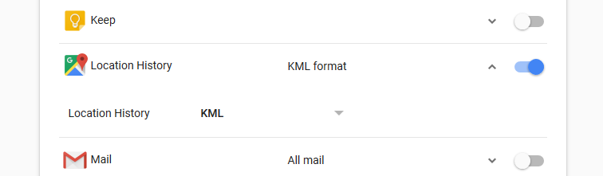

# Geotagging photos with exiftool

I use Google Photos to upload selected photos I take on my vacations, and I very much like how it geotags my photos and links it to Google Maps. The ability to record where I took a photo is a nice perk to have.

As much as I like my dedicated camera, it is terrible at geotagging photos. The on-board geotagging feature requires a paired wireless connection to an app installed on my phone. Not only does this setup gobble up battery on both the camera and the phone, it also denies my phone of a wireless connection (useful while travelling).

So, to tag my photos, I've been doing the following

1. Leave location tracking on my Android phone active
2. Set my camera's clock to UTC
3. Take my photos
4. Download the photos, and my location history from Google Takeout
5. Geotag photos
6. Fix timezones

I use [exiftool](https://www.sno.phy.queensu.ca/~phil/exiftool/), a nifty metadata manipulation tool to fix timezones (and geotag as well).

## Grab your location history

1. Go to [Google Takeout](https://takeout.google.com/settings/takeout)
2. Select just your location history and change it to KML
  
3. Download and uncompress it somewhere (I put it alongside the photos to be edited)

## Geotag

Because all my photos are taken in UTC I run the following command to tag my photos

```
exiftool -geotag Location\ History.kml '-geotime<${DateTimeOriginal}+00:00' . -api GeoMaxIntSecs=108000
```

If, somehow, the photos are in local time change the timezone offset in that command (eg, for California, which is -7 UTC)

```
exiftool -geotag Location\ History.kml '-geotime<${DateTimeOriginal}-07:00' . -api GeoMaxIntSecs=108000
```

`-api GeoMaxIntSecs=108000` sets the interpolation to 108000 seconds, or 30 minutes.

>|||
>|-|-|
>Latitude|`37,49.0876N`
>Longitude|`122,28.9866W`

Check the EXIF, and once satisfied, remove the originals. Google shows me the location if I [search for `37 49.0876N, 122 28.9866W`](https://www.google.com/search?q=37+49.0876N%2C+122+28.9866W).

```
rm *_original
```

## Timestamps

The EXIF standard does not specify a timezone field, and so most people set the camera's clock to the local time as needed. Obviously, this is a giant PITA due to timezones (and DST!), so I leave my camera's clock set to UTC and adjust the files on a desktop instead.

What's really helpful when taking this approach is to take at least one picture of a clock, or of road signage to make it easy to verify geotags or timestamps later on.

You can leave your timestamps in UTC. However, I change the timestamps into local time so they sort properly in Google Photos.

For photos taken in New York in July (UTC-4), I might run this command while in a directory with all the photos I want to edit

```
exiftool "-DateTimeOriginal-=0:0:0 4:0:0" *
```

This shifts the `DateTimeOriginal` field by -4 hours.

For photos taken in Singapore (UTC+8), the following command shifts the timestamp 8 hours forward instead

```
exiftool "-DateTimeOriginal+=0:0:0 8:0:0" *
```

Note the `+=` and `-=` to shift times around.

>|||
>|-|-|
>DateTimeOriginal|`15/06/2018 00:05:12`

Once that's done, do a quick check of the EXIF, and then delete the originals once satisfied

```
rm *_original
```

## Lightroom, GPicSync

I used to use Lightroom and GPicSync, but never could get them to work without spending an entire afternoon encountering weird bugs.

## TL;DR

1. [Install exiftool](https://www.sno.phy.queensu.ca/~phil/exiftool/)
2. Download "Location History" in KML from [Google Takeout](https://takeout.google.com/settings/takeout)
3. `exiftool -geotag Location\ History.kml '-geotime<${DateTimeOriginal}+00:00' . -api GeoMaxIntSecs=108000`
4. `exiftool "-DateTimeOriginal+=0:0:0 8:0:0" *`
5. `rm *_original`
