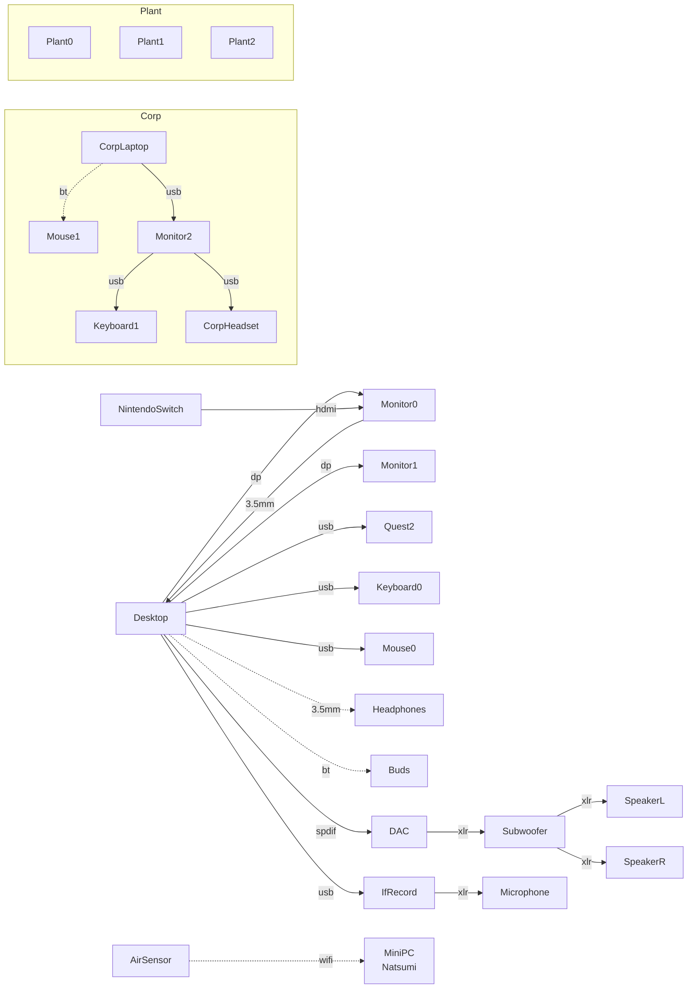
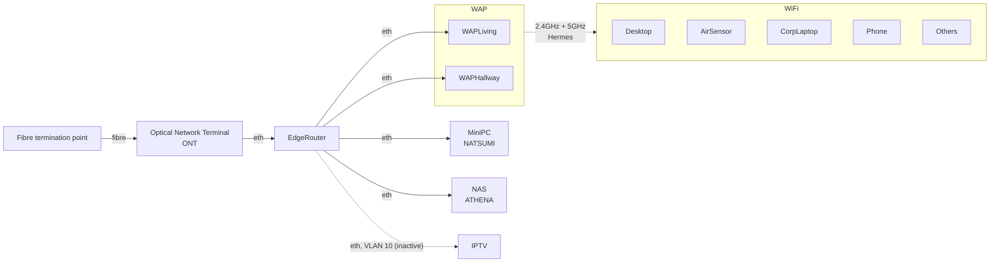

# Home diagrams

## Desk setup

A logical view of my desk. A goal is to keep personal and work setups nearby, but physically separated.

    
## Network

The goal is to keep things as simple as possible.

