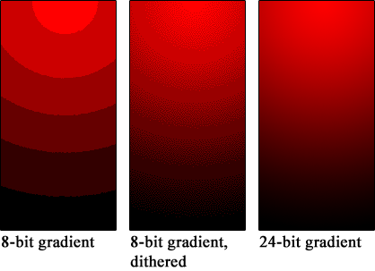
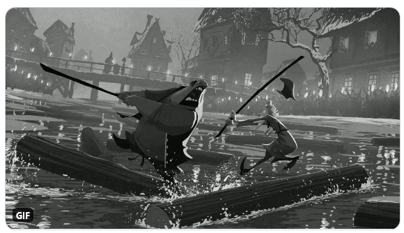

<style>
p[style] {
  background-color: var(--c);
  padding: 20px;
  border: solid 4px black;
  border-radius: 16px;
}

p[style]::after {
  white-space: nowrap;
  content: attr(style);
  color: white;
  filter: grayscale(1);
  mix-blend-mode: difference;
}
</style>

# Colour 101 for programmers
October 2020

---

## Why should I care?

<!-- My goal today is to convince you that you should care about colour -->

---

<div style="font-size: 160px; font-family: Impact; font-style:">📸 InstaTok</div>

<!-- Today, we are going to build our new product, InstaTok. I'm going to use this example to illustrate some colour concepts -->

---

## 🕵️‍♀️ PM: Our competitor has a new filter.
## 🕵️‍♀️ PM: It takes a picture of an orange and turns you orange.

---


<!-- This is our image here of our beautiful peppers -->

---


<!-- This is our image here of our not-so-handsome subject -->

---

<style scoped>
* { columns: 2 }
</style>

 Peppered mandrill


<!-- This is our image here of our improved subject -->

---

# ☀ → 🍎 → 📷 → 🕳🕳🕳 → 🖼

<!-- We're going to skim through how a digital camera actually works, and get started from the output -->
<!-- Basically a digital camera is a photons counter, and assigns pixels their colours based off the photon counts -->

<!-- We are going to start at the right, as that's what's we're interested in as IT developers -->

---

# 🖼 $1010111011010$

---

# 🖼 $1010111011010$

# ↓

# `struct MyImageSurface { ... }`

---

## Colour spaces


<!-- If you've been shopping around for consumer tech you might have seen things like sRGB or DCI P3 -->

---

Basically, how to refer to a particular colour

<p style="--c: rgb(255, 255, 0)"></p>

---

## CSS colours

* red, green, blue
  <p style="--c: rgb(255, 255, 0)"></p>

* hue, saturation, lightness
  <p style="--c: hsl(60, 100%, 50%)"></p>

---

## CSS colours for the future

<p style="--c: rgb(0, 255, 0)"></p>

<p style="--c: color(display-p3 1 0.5 0)"></p>

*WebKit only as of 2020*

---

## Subtractive colour spaces

CMY, CMYK

<!-- I don't have much experience with this -->

---

## Additive colour spaces

sRGB, HSL, HSV etc.

<!-- Basically, adding up different colours of light to create a different colour -->

---

## Additive colour spaces

sRGB, HSL, HSV etc.

* Super convenient
* Well-supported
* Easy to reason with

---

HSL is great for colour hashes

```js
const hue = hash(username) % 255;
const color = `hsl(${hue}, 50%, 50%)`;
```

---

## Perceptual colour spaces

CIE L\*a\*B\*, CIE LUV

* When colour matters
* When calculating colour difference
* When humans are involved

---


https://programmingdesignsystems.com/color/perceptually-uniform-color-spaces/

---


https://programmingdesignsystems.com/color/perceptually-uniform-color-spaces/

---


https://programmingdesignsystems.com/color/perceptually-uniform-color-spaces/

---

## Colour in design systems

Usually, design systems specify colour variants using the same values in RGB

---


<!-- focus on the readability of the content -->

---

## Subtractive

CMY, CMYK

<!-- Used when printing, or designing for print -->

---

## Back to InstaTok

We want to get the dominant colours so we can transfer them

---


RGB

LAB


<!-- Used a median-cut. So which one do we pick? Artistically whichever makes a prettier picture, we're a filter app -->

---

```rs
let colours: Vec<RGBA> = extract_colors(&peppers_image);
```


<!-- So now we have a list of colours, and now we need to replace the monkey's colours -->

---

```rs
let colours: Vec<RGBA> = extract_colors(&peppers_image);
let green_monkey = apply_palette(&blue_monkey, &colours);
```

---

# `apply_palette`

```
foreach(pixel):
  foreach(palette_color):
    find_and_return_smallest_difference(pixel, palette_color)
```

---

# `apply_palette`

```
foreach(pixel):
  foreach(palette_color):
    // We need to define "difference"
    find_and_return_smallest_difference(pixel, palette_color)
```

---

||RGB+RGB|LAB+LAB|
|-|-|-|
||||

<!-- And we're done! Let's send off this marathon of a task. Or are we? -->

---

## 🕵️‍♀️ PM: Rejected. Users *need* to save their snaptoks!

---

## Image encoding

* Lossy vs lossless
* YUV and chroma subsampling

---

## Bit depth

Number of bits to represent a channel



<!-- Dithering/add noise/increase bit depth -->

---

|1-bit|2-bit|3-bit|4-bit|8-bit|
|-|-|-|-|-|
||||||

---

## Images

|lossless|lossy|vector|
|-|-|-|
|BMP, PNG|JPEG|SVG|
|illustrations, UI|photos|illustrations, UI|

<!-- Won't cover this in depth here, but essentially  -->

---

## Videos

|lossless|lossy|vector|
|-|-|-|
|APNG, GIF*|GIF*, MPEG, h264|SVG, SWF|

---

## YUV

Common in videos


---

## YUV

* RGB888 = 24-byte pixel
* YUV420p = 6-byte pixel~

---

## YUV takeaways

* hard to work with on a per-pixel basis
* luma usually encoded at twice the resolution of colour
* video is hard

---

## Colour spaces for video

* sRGB: computers
* Rec. 709: TVs
* DCI P3: cinema

---

## 🕵️‍♀️ PM: Rejected. QA reports the colours are wrong!

---

## Luminance perception


Apply gamma (de)correction when needed

<!-- Linearization needed for calculations, for example -->
<!-- Humans perceive differences in darkness in "higher resolution" than in lightness -->
<!-- Humans are also more sensitive to luminance -->

---

## Colour sensitivity

  <div style="display: flex;">
    <div style="margin: 20px; background-color: black; color: hsl(240, 100%, 50%); padding: 20px;">
      cat
    </div>
    <div style="margin: 20px; background-color: black; color: hsl(60, 100%, 50%); padding: 20px;">
      cat
    </div>
    <div style="margin: 20px; background-color: white; color: hsl(240, 100%, 50%); padding: 20px;">
      cat
    </div>
    <div style="margin: 20px; background-color: white; color: hsl(60, 100%, 50%); padding: 20px;">
      cat
    </div>
    <div style="margin: 20px; background-color: black; color: hsl(240, 0%, 50%); padding: 20px;">
      cat
    </div>
    <div style="margin: 20px; background-color: black; color: hsl(60, 0%, 50%); padding: 20px;">
      cat
    </div>
    <div style="margin: 20px; background-color: white; color: hsl(240, 0%, 50%); padding: 20px;">
      cat
    </div>
    <div style="margin: 20px; background-color: white; color: hsl(60, 0%, 50%); padding: 20px;">
      cat
    </div>
  <div>

<!-- Humans are sensitive to yellow/green than blue -->
<!-- All have the same saturation and brightness -->
<!-- 
When picking colours (eg, for charts), consider

* saturation
* luminance -->

---

## Contrast


<!-- Same shade, but different perception -->
<!-- Not just on the screen, but also around the screen -->
<!-- Lighting conditions and the like, maybe QA needs to turn off his grow lamps -->

---

## Colour management

Too much out there, too much I don't know about

* Web browsers: depends
  - Firefox has issues as of 2020
* OS: set up colour profiles
* Photoshop: I can't get it to work
* Monitors: calibration needed

<!-- Where you need to get the entire chain from image to display calibrated -->
<!-- Buy QA a better screen -->

---

## "Oversaturation"

sRGB → DCI P3


<!-- Basically, you're stretching RGB stuff into P3, common in 2020 -->
<!-- On the web, everything defaults to sRGB -->
<!-- If your colour management chain is broken somewhere, eg, browser doesn't translate content or OS isn't aware, you get a situation where your reds are too red and your greens are too green -->

---

## Colour blindness

* $\approx$ 8% in males, $\approx$ 0.5% in females
* Use luma for contrast, not colour
* Colour contrast can be more difficult to see
* Simulate using tools in browser

https://commandcenter.blogspot.com/2020/09/color-blindness-is-inaccurate-term.html

---

## Side note: Photoshop is broken

* Desaturation doesn't work in Photoshop?

---


---


---




---


<!-- If you remember colour spaces, we should apply a perceptual function before desaturating -->

---

## In my experience

* Don't treat pixels as RGB
  - format (YUV, RGB)
  - channel (R, G, B, Y)
* Pixel data might not be contiguous

<!-- An abstraction which might not make sense in planar formats (YUV) -->

---

* Don't treat images as bitmaps
  - convert if needed
  - have a `Surface` abstraction to get pixels

---

* Manipulate images as bitmaps

<!-- It's the easy thing to do -->

---

* Work in a single colour space

---

* Consider the pipeline
* Including the human

---

## Easy if you don't need to care

Everything is a RGB bitmap

---

## You will need to care soon

* Wide gamut screens with >100% sRGB coverage
* HDR displays
* CSS support
* OS, OpenGL, DirectX support

---

## Everything can go wrong

* input
* manipulation
* encoding
* display
* human
