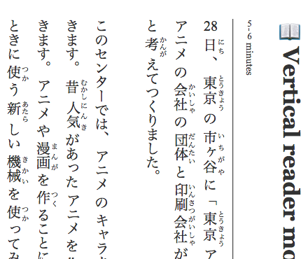
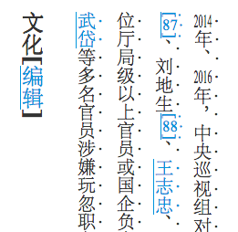
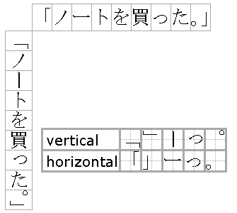
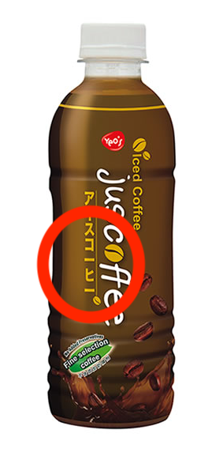
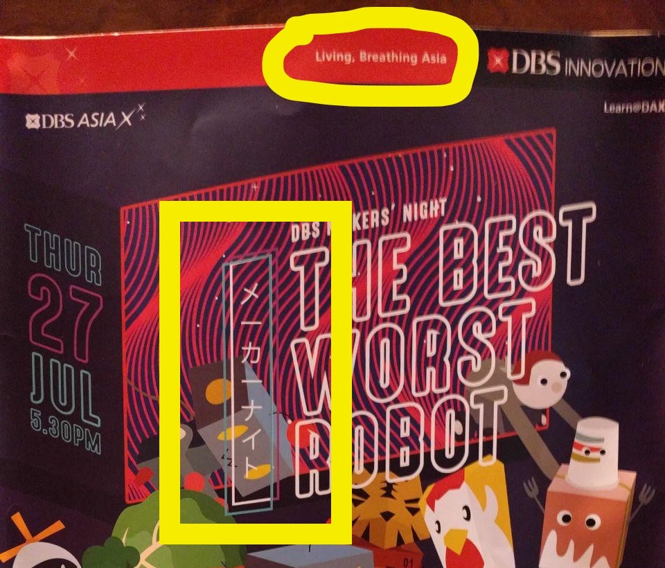

## And some HTML

Feb 2018

---

## New

`display: grid`

<iframe src="e/grid/index.html"></iframe>

---

## Old

`border-image`

<iframe src="e/border-image/index.html"></iframe>
(Limited Chrome support)

---

## Useless?

`caret-color`

<input type="text" style="caret-color: red; font-size: 3em; width: 100%;" placeholder="don’t do this?">


<input type="text" style="caret-color: transparent; font-size: 3em; width: 100%;" placeholder="don’t do this">


---

# insert good bad ugly edit

---

#

&vellip;
<pre style="font-size: 75%">
text-underline-color	N/A	0.00%
grid	3	0.00%
text-line-through-color	N/A	0.00%
text-line-through-width	N/A	0.00%
justify-self	3	0.00%
text-line-through-style	N/A	0.00%
text-overline-color	N/A	0.00%
mask-source-type	3	0.00%
grid-auto-columns	3	0.00%
grid-auto-rows	3	0.00%
grid-template-areas	3	0.00%
text-line-through-mode	N/A	0.00%
text-overline-mode	N/A	0.00%
text-overline-style	N/A	0.00%
text-underline-width	N/A	0.00%
text-underline-mode	N/A	0.00%
text-overline-width	N/A	0.00%
</pre>

[Source](https://docs.google.com/spreadsheets/d/1CxLS8w8GwK-2euVErrqpUUb76PiZa6w5h5EnGsL9KFs/edit#gid=555855884)

---

# Cursor
`cursor: crosshair`
<div class="box" style="cursor: crosshair">
Crosshair
</div>

`cursor: url(...)`

<div class="box" id="cursor-animated">
?
</div>

---

# Grid

---

# Flexbox

* Flexbox is already widespread but
* `order`

---

# Web Video Text Tracks Format (WebVTT)

<iframe src="e/webvtt/sub.vtt" style="font-size: 200px"></iframe>

---

# Styled WebVTT


```css
video::cue(b) {
    color: red !important;
}
```

<iframe src="e/webvtt/index.html"></iframe>

Limited support

---

# Shadow DOM

---

# Typography CSS

---

# `columns`, `:first-*`

```css
p { columns: 3 auto };
p:first-line { font-family: 'Vollkorn SC'; }
```

<div class="box" style="max-height: 50%;" id="col">
<p style="columns: 3 auto; font-size: 14px; overflow: hidden;">
Call me Ishmael. Some years ago—never mind how long precisely—having little or no money in my purse, and nothing particular to interest me on shore, I thought I would sail about a little and see the watery part of the world. It is a way I have of driving off the spleen and regulating the circulation. Whenever I find myself growing grim about the mouth; whenever it is a damp, drizzly November in my soul; whenever I find myself involuntarily pausing before coffin warehouses, and bringing up the rear of every funeral I meet; and especially whenever my hypos get such an upper hand of me, that it requires a strong moral principle to prevent me from deliberately stepping into the street, and methodically knocking people’s hats off—then, I account it high time to get to sea as soon as I can. This is my substitute for pistol and ball. With a philosophical flourish Cato throws himself upon his sword; I quietly take to the ship. There is nothing surprising in this. If they but knew it, almost all men in their degree, some time or other, cherish very nearly the same feelings towards the ocean with me.</p>
</div>

---

# `:first-letter`

```css
p:first-letter {
    float: left;
    font-size: 700%;
    background: black;
    color: white;
    padding: 0.1em;
    margin: 0 0.05em 0.05em 0;
    border: outset 4px gold;
    text-shadow: 1em 1em 2em rgba(255, 215, 0, 0.5), 0 0 1em rgba(255, 215, 0, 0.5), 0 0 0.2em rgba(255, 215, 0, 0.5), 1px 1px 0 #ecdc25, -1px -1px 0 #90582e, 1px -1px 0 #ecdc25, -1px 1px 0 #90582e, 3px 3px 5px #333;
}
```

<div class="box" style="max-height: 50%;" id="col2">
<p style="font-family: Vollkorn; columns: 3 auto; font-size: 14px; overflow: hidden;">
Call me Ishmael. Some years ago—never mind how long precisely—having little or no money in my purse, and nothing particular to interest me on shore, I thought I would sail about a little and see the watery part of the world. It is a way I have of driving off the spleen and regulating the circulation. Whenever I find myself growing grim about the mouth; whenever it is a damp, drizzly November in my soul; whenever I find myself involuntarily pausing before coffin warehouses, and bringing up the rear of every funeral I meet; and especially whenever my hypos get such an upper hand of me, that it requires a strong moral principle to prevent me from deliberately stepping into the street, and methodically knocking people’s hats off—then, I account it high time to get to sea as soon as I can. This is my substitute for pistol and ball. With a philosophical flourish Cato throws himself upon his sword; I quietly take to the ship. There is nothing surprising in this. If they but knew it, almost all men in their degree, some time or other, cherish very nearly the same feelings towards the ocean with me.</p>
</div>

---

# `text-justify`

```css
p {
    text-align: justify
    text-justify: distribute;
};
```

<div class="box" style="max-height: 50%;" id="col">
<p style="columns: 3 auto; font-size: 14px; overflow: hidden; text-align: justify; text-justify: distribute;">
Call me Ishmael. Some years ago—never mind how long precisely—having little or no money in my purse, and nothing particular to interest me on shore, I thought I would sail about a little and see the watery part of the world. It is a way I have of driving off the spleen and regulating the circulation. Whenever I find myself growing grim about the mouth; whenever it is a damp, drizzly November in my soul; whenever I find myself involuntarily pausing before coffin warehouses, and bringing up the rear of every funeral I meet; and especially whenever my hypos get such an upper hand of me, that it requires a strong moral principle to prevent me from deliberately stepping into the street, and methodically knocking people’s hats off—then, I account it high time to get to sea as soon as I can. This is my substitute for pistol and ball. With a philosophical flourish Cato throws himself upon his sword; I quietly take to the ship. There is nothing surprising in this. If they but knew it, almost all men in their degree, some time or other, cherish very nearly the same feelings towards the ocean with me.</p>
</div>


---

# `unicode-range`

* Useful for fonts without tabular figures
* Custom emoji fonts

```css
@font-face {
    font-family: ComicNumerals;
    src: local(Comic Sans MS), local(Chalkboard);
    unicode-range: U+30-39; /* ASCII 0-9 */
}
```

<div class="box" id="unicoder">
Nineteen Eighty-Four, often published as 1984, is a dystopian novel published in 1949 by English&hellip;
</div>

---

# `font-feature-settings`

<link href="https://fonts.googleapis.com/css?family=Vollkorn:400,400i" rel="stylesheet">

Toggles *OpenType* features in fonts

```css
p { font-feature-settings: "liga" on; }
```

<div class="box" style="font-family: Vollkorn; font-size: 150%; font-feature-settings: 'liga' on;">
fjords iffy affiliate fizz
</div>

```css
p { font-feature-settings: "liga" off; }
```

<div class="box" style="font-family: Vollkorn; font-size: 150%; font-feature-settings: 'liga' off;">
fjords iffy affiliate fizz
</div>

# `font-feature-settings`

<!-- Scam warning: Google Fonts split up Vollkorn -->
<link href="https://fonts.googleapis.com/css?family=Vollkorn+SC" rel="stylesheet">

```css
p { font-feature-settings: "scmp"; }
```

<div class="box" style="font-family: Vollkorn SC; font-size: 150%;">
<p>Small Caps</p> <p>Aa Bb Cc Dd Ee Ff</p> <p>US nato asean <span style="font-family: Vollkorn">9</span>am&ndash;<span style="font-family: Vollkorn">17</span>pm</p>
</div>

---

# `font-feature-settings`

Useful settings

* `liga` Required Ligatuers
* `smcp` Small Caps
* `dlig` Discretionary Ligatures
* `tnum` Tabular Figures
* `zero` Slashed Zero
* `swsh` Swash

[Feature list](https://www.microsoft.com/typography/otspec/featurelist.htm)

---

# RTL text

```css
p {
    direction: rtl;
    unicode-bidi: normal;
}
```

<div class="box" style="direction: rtl; unicode-bidi: normal;">
الموسوعة الحرة التي يستطيع الجميع تحريرها. توجد الآن 560٬021 مقالة بالعربية.
</div>

---

# Vertical text

```css
p {
    writing-mode: vertical-rl;
    hanging-punctuation: end;
}
```



---

# `text-orientation`

```css
p {
    writing-mode: vertical-rl;
    text-orientation: upright;
}
```

<div style="border: solid 1px black; padding: 20px; max-height: 25%; writing-mode: vertical-rl; text-orientation: upright;">
Wikipedia, the free encyclopedia 维基百科，自由的百科全书
</div>


<div style="border: solid 1px black; padding: 20px; max-height: 25%; writing-mode: vertical-lr; text-orientation: mixed;">
Wikipedia, the free encyclopedia 维基百科，自由的百科全书
</div>

---

# Emphasis in Asian scripts

```css
*:lang(ja) emp {
    text-emphasis-style: filled sesame;
}

*:lang(zh) emp {
    text-emphasis-style: filled dot;
}
```



---

# Vertical numerals

Tate-chu-yoko (縦中横)

```css
p, li::marker {
    text-combine-upright: digits 4;
}
```


---

# Vertical punctuation



If the font supports it, setting the writing mode enables vertical punctuation

---

# Just one more thing&hellip;

---

# &hellip;for you to be annoyed by

---

# A sour taste?



---

# Living, Breathing Asia?



---

# `@media`

* Different rules for different viewing devices
* Responsive design

```css
@supports (display: flex) {
  @media screen and (min-width: 900px) {
    article {
      display: flex;
    }
  }
}
```

---

# Print CSS

* `@media print`
* `@page`
* `page-break-after`, `page-break-before`
* `orphans`, `widows`
* `size`

---

# `@media print`

Apply selectors to your webpage in print

```css
@media print {
    section {
        height: 100%;
        page-break-after: always;
        font-size: 16px;
        color: black;
    }
}
```

---

# `@page`

[W3C](https://drafts.csswg.org/css-page-3/#at-page-rule)&nbsp;&middot;&nbsp;
[MDN](https://developer.mozilla.org/en-US/docs/Web/CSS/%40page)

Selectors for the printed page ***itself***

```css
@page { /* size: A4 landscape; */ }

/* cover */
@page:first { font-size: 192px; }

/* verso */
@page:left { margin: 5cm 10cm 5cm 5cm; }

/* recto */
@page:right { margin: 5cm 5cm 5cm 10cm; }
```

---

# url(), lang(), dir()

---

# isolation

---

# position: sticky

Show the example here

https://developer.mozilla.org/en-US/docs/Web/CSS/position

---

# filters

Frosted glass effect?

---

# SVG filters

---

# SVG rules

---

# clip-path, mask-clip

---

# List formatting

---

# ::spelling-error, ::grammar-error

---

# ::first-letter, ::first-line, ::placeholder, ::selection

---

# Different units

---

# background-size, object-fit

object-fit less common than background-size

---

# @import

---

# Selectors

* List all, then drill down

---

# scrollbar

---

# border-iamge, border-style

---

# caption-side

---

# #RRGGBBAA colors, different colors

---

# pointer-events

---

# 3x3 css transformations, cool demo!

---

# scroll-behaviour, overscroll-behavior

---

# Every rule is a good rule

These rules are already in your toolbox

---

# Hammer, nail, etc.

---

# Links

https://developer.mozilla.org/en-US/docs/Web/Demos_of_open_web_technologies#CSS
http://www.voxelcss.com/
https://a.singlediv.com/
