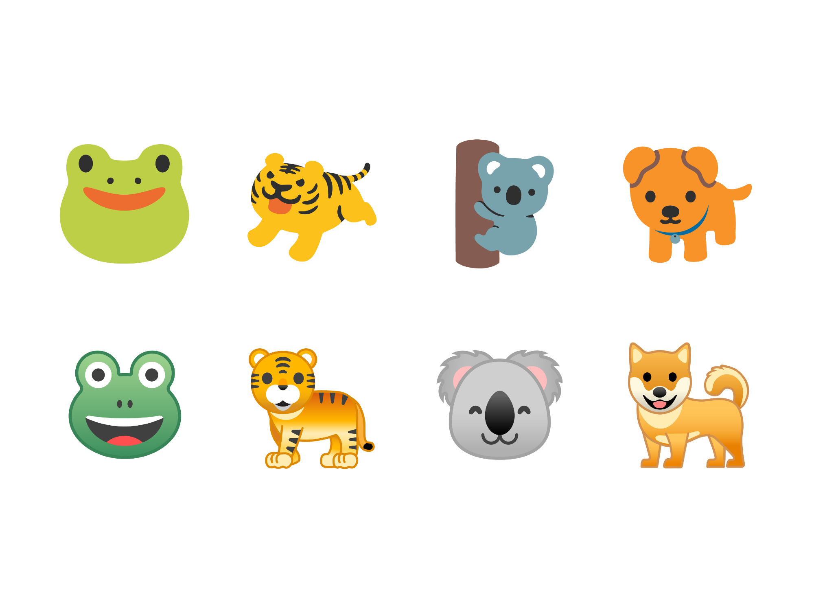
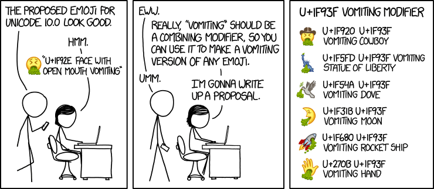

<!-- As I discovered way too late, Marp cannot render emoji in exported PDFs https://github.com/yhatt/marp/issues/57 -->

<!-- $theme: default -->

<!-- page_number: true -->

# Unicode and its 🕳🍁s: normalisation, Han unification and m͢ore

###### 2017

###### https://github.com/gyng/book/tree/master/slides/unicode

---

<pre>
> 1 + 1;
← 2

> 1 + 1&#894;
← 🚨 SyntaxError: illegal character 🚨
</pre>

---

# Encodings

*not encryption*

---

## Braille

```
⠀⠁⠂⠃⠄⠅⠆⠇⠈⠉⠊⠋⠌⠍⠎⠏⠐⠑⠒⠓⠔⠕⠖⠗⠘⠙⠚⠛⠜⠝⠞⠟
⠠⠡⠢⠣⠤⠥⠦⠧⠨⠩⠪⠫⠬⠭⠮⠯⠰⠱⠲⠳⠴⠵⠶⠷⠸⠹⠺⠻⠼⠽⠾⠿
⡀⡁⡂⡃⡄⡅⡆⡇⡈⡉⡊⡋⡌⡍⡎⡏⡐⡑⡒⡓⡔⡕⡖⡗⡘⡙⡚⡛⡜⡝⡞⡟
⡠⡡⡢⡣⡤⡥⡦⡧⡨⡩⡪⡫⡬⡭⡮⡯⡰⡱⡲⡳⡴⡵⡶⡷⡸⡹⡺⡻⡼⡽⡾⡿
⢀⢁⢂⢃⢄⢅⢆⢇⢈⢉⢊⢋⢌⢍⢎⢏⢐⢑⢒⢓⢔
```

---

## “Ancient” encodings


---

## “Ancient” encodings &mdash; Morse

```text
M   O   R   S  E          C    O   D  E
−− −−− ·−· ··· · (space) −·−· −−− −·· ·
```

* Three letters: $\{ \_, ., EOW \}$
* Variable-width letters

---

## “Ancient” encodings &mdash; Chinese telegraph code


---

## “Ancient” encodings &mdash; Chinese telegraph code

```text
電   碼

7193 4316
--... .---- ----. ...-- / ....- ...-- .---- -....

EGL  EWS
. --. .-.. / . .-- ...
```

* Same characters, different encodings, different lengths
* The ***code point*** (電 $=$ 7193) is not the ***encoding*** (morse)

---

## ASCII

```
Dec Hex    Dec Hex    Dec Hex  Dec Hex  Dec Hex  Dec Hex   Dec Hex   Dec Hex
  0 00 NUL  16 10 DLE  32 20    48 30 0  64 40 @  80 50 P   96 60 `  112 70 p
  1 01 SOH  17 11 DC1  33 21 !  49 31 1  65 41 A  81 51 Q   97 61 a  113 71 q
  2 02 STX  18 12 DC2  34 22 "  50 32 2  66 42 B  82 52 R   98 62 b  114 72 r
  3 03 ETX  19 13 DC3  35 23 #  51 33 3  67 43 C  83 53 S   99 63 c  115 73 s
  4 04 EOT  20 14 DC4  36 24 $  52 34 4  68 44 D  84 54 T  100 64 d  116 74 t
  5 05 ENQ  21 15 NAK  37 25 %  53 35 5  69 45 E  85 55 U  101 65 e  117 75 u
  6 06 ACK  22 16 SYN  38 26 &  54 36 6  70 46 F  86 56 V  102 66 f  118 76 v
  7 07 BEL  23 17 ETB  39 27 '  55 37 7  71 47 G  87 57 W  103 67 g  119 77 w
  8 08 BS   24 18 CAN  40 28 (  56 38 8  72 48 H  88 58 X  104 68 h  120 78 x
  9 09 HT   25 19 EM   41 29 )  57 39 9  73 49 I  89 59 Y  105 69 i  121 79 y
 10 0A LF   26 1A SUB  42 2A *  58 3A :  74 4A J  90 5A Z  106 6A j  122 7A z
 11 0B VT   27 1B ESC  43 2B +  59 3B ;  75 4B K  91 5B [  107 6B k  123 7B {
 12 0C FF   28 1C FS   44 2C ,  60 3C <  76 4C L  92 5C \  108 6C l  124 7C |
 13 0D CR   29 1D GS   45 2D -  61 3D =  77 4D M  93 5D ]  109 6D m  125 7D }
 14 0E SO   30 1E RS   46 2E .  62 3E >  78 4E N  94 5E ^  110 6E n  126 7E ~
 15 0F SI   31 1F US   47 2F /  63 3F ?  79 4F O  95 5F _  111 6F o  127 7F DEL
```

http://www.catb.org/esr/faqs/things-every-hacker-once-knew/

---

[](https://youtu.be/MikoF6KZjm0?t=289)
https://youtu.be/MikoF6KZjm0?t=289

---

## ASCII

* 1963
* American Standard Code for Information Interchange
* 7-bit (8<sup>th</sup> bit used for parity)
* $2^7 = 128$ possible values

---

## ASCII

* 0&ndash;31 are control characters `NUL` `CR` `LF` `DEL` etc.
* 32&ndash;126 are punctuation, numerals and letters
* <code>&#x2423;</code> in binary: `0100000` $=20$
* `A` in binary: `1000001` $= 65$
* `a` in binary: `1100001` $= 65 + 32 = 97$
* Alternative: IBM’s EBCDIC (also 1963)

---

## Modified ASCII

* Extended ASCII (8-bit, has more characters `Ç` `ü` `▒` `¶` `æ`)
* Modified 7-bit ASCII exist
  * `#` → `£` on UK teletypes
  * `\` → `¥` in Japan (Shift-JIS)
  * `\` → `₩` in Korea (EUC-KR)

---

## ASCII Highlights

### Control characters

* `CR` Moves the print head to the left margin
* `LF` Scrolls down one line
* `DEL` Backspace and delete
* `BEL` Rings the (physical) bell

```
sleep 3 && echo $'\a'
```

---

## Problems with ASCII

* Latin-centric
* Everybody else came up with their own encodings
* Alternative ASCII sets cause problems with interchange
* Mojibake (<ruby>文字 <rt>moji</rt></ruby><ruby>化け<rt>bake</rt></ruby>): JIS, Shift-JIS, EUC, and Unicode
* No emoji, only emoticons :-(

---

## Dark ages 

* ???
* ???
* ???
* ???
* ???
* Xerox Character Code Standard (XCCS), 1980

---


---

# Unicode

---

## Timeline of Unicode

* 1985, Sapporo, 🗾 
* KanjiTalk, localised 🍎
* Shift-JIS is a 💩
* Bunch of 👷 start working on Unicode specs
* 1988, submitted to ISO 📰
* 1991, Han Unification accepted 🤔
* 1992, 👋 *Kiss Your ASCII Goodbye* in *PC Magazine*
* 1995, ☕ Java 1.0 launches with Unicode support

http://www.unicode.org/history/earlyyears.html

---

<a href="https://streamable.com/s/76u3l/ojyjkb">
<div style="width:100%;height:0px;position:relative;padding-bottom:75.000%;"><iframe src="https://streamable.com/s/76u3l/ojyjkb" frameborder="0" width="100%" height="100%" allowfullscreen style="width:100%;height:100%;position:absolute;left:0px;top:0px;overflow:hidden;"></iframe></div>
</a>

The first Unicode TV interview (1991)
http://www.unicode.org/history/unicodeMOV.mov

---

<a href="https://streamable.com/s/kad84/xtfcvq">
<div style="width:100%;height:0px;position:relative;padding-bottom:75.000%;"><iframe src="https://streamable.com/s/kad84/xtfcvq" frameborder="0" width="100%" height="100%" allowfullscreen style="width:100%;height:100%;position:absolute;left:0px;top:0px;overflow:hidden;"></iframe></div>
</a>

Unicode: the Movie (2000)
http://www.unicode.org/history/movie/UniMovie-large.mov

---

## Unicode features*
* A common representation for all characters
* $\simeq$ Compatible with ASCII for English (`A` $= 65$)
* Efficient encoding
* ~~Uniform width encoding~~
* Han unification (CJK languages share glyphs)

---

## Unicode 10.0 (2017 June 20)

>Unicode 10.0 adds 8,518 characters, for a total of 136,690 characters

http://www.unicode.org/versions/Unicode10.0.0/

>56 emoji (2,666 total)

http://www.unicode.org/reports/tr51/tr51-12.html#Emoji_Counts

>Bitcoin sign

*&hellip;and more*

---

## Unicode terminology

* Scalar value `€` `U+20AC EURO SIGN`
* Range `U+0000..U+FFFF`
* Sequence  `É` `< U+0045 LATIN CAPITAL LETTER E, U+0301 COMBINING ACUTE ACCENT >`
* **Code points are not encoding**
* **Unicode is not an encoding, but a standard**

---

## Unicode planes

* `U+0000..U+FFFF` is Plane 0, Basic Multilingual Plane (BMP)
* Each plane encodes up to $2^{16} = 65536$ code points
* Commonly used characters
* Language “detection”

---

## UTF-16

* Early UTF-16 was fixed-width (UCS-2)
* 2 or 4 bytes per character
* 2 bytes for characters in BMP
  * Can be more efficient than UTF-8 for CJK (2B vs 3B)
* Surrogate pairs have to be handled for code points outside BMP

---

## UTF-32

* 32 bits ought to be enough for anybody
* Problem solved?

---

## UTF-32

* `A` now takes up 4 bytes

---

## UTF-8

* Variable-width
* `1100XXXX` `10XXXXXX`
* `1110XXXX` `10XXXXXX` `10XXXXXX`
* `1111110X` `10XXXXXX` `10XXXXXX` `10XXXXXX` `10XXXXXX` `10XXXXXX`
* First byte specifies number of continuation bytes

---

## Reserved space

* `U+nFFFE`, `U+nFFFF`: reserved space for developers
* Suggested for internal use
  * data processing
  * artificial scripts
  * ancient scripts
*  `U+F8FF` (`⇧`-`⌥`-`k`)
* Ubuntu has `U+E0FF` and `U+F200`
  

---

## Combining characters

* Modify other characters
  `e` $+$ ` ́` $=$ `é`
  
  `e U+0065 LATIN SMALL LETTER E`
  ` ́ U+0301 COMBINING ACUTE ACCENT`

* Precomposed `é`
  `é U+00E9 LATIN SMALL LETTER E WITH ACUTE`

* Modifiers come after base character

---

## Unicode normalisation

* Some combined characters are sort of the same
* Equivalence criteria
  * canonical (NF)
  * compatibility (NFK)
* `ffi` `U+FB03 LATIN SMALL LIGATURE FFI` vs `f` `f` `i`
  * not equivalent under canonical (NF)
  * equivalent under NFK compatiability (NFK)
* NF is used to canonicalise combining characters

---

## Unicode normalisation

* NFD *Normalization Form Canonical Decomposition*
* NFC *Normalization Form Canonical Composition*
* NFKD *Normalization Form Compatibility Decomposition*
* NFKC *Normalization Form Compatibility Composition*

---

## Han unification

* Maps common Chinese, Japanese, Korean (CJK) characters into unified set
  
* Different countries have different standards

---

## Han unification

* Variants can be significant (names)
<ruby>`芦`<rt>ashi</rt></ruby> Ashi·da, given name vs Ashi·ya, old place name
  
* Educational software
* People get 😡 over the differences

---

## Han unification

> CJK Extension F contains mostly rare characters, but also includes a number of personal and placename characters important for government specifications in Japan, in particular.
 
CJK Extension F was added in Unicode 10.0 (2017)

---

## Han unification

* Lose round-trip conversion compatibility with character sets which have variants
* Can use Unicode variation selectors

  `U+E0101 VARIATION-SELECTOR-18`

  

http://www.unicode.org/ivd/
http://unicode.org/reports/tr37/

---

## Control sequences and vertical text

* Vertical text
* RTL mark
  

*Unicode Bidirectional Algorithm* @ http://unicode.org/reports/tr9/
*Unicode Vertical Text Layout* @ http://www.unicode.org/reports/tr50/

---

## Ligatures

>Unicode maintains that ligaturing is a presentation issue rather than a character definition issue

* But! There are some predefined ligatures
  `ffl U+FB04 LATIN SMALL LIGATURE FFL`
  `Ꜹ U+A738 LATIN CAPITAL LETTER AV`
  `æ U+00E6 LATIN SMALL LETTER AE`

* Similar issue with subscript and superscript

---

## Emoji

* 絵 (e ≅ picture) + 文字 (moji ≅ written character)
* Early emoji were created by Japanese telcos
* 2008: Gmail, iPhone
* 2010: Unicode 6
* 🈲 🈳 🈴 🈵 🈶 🈷️ 🈸 🈹 🈺 🆖 🆗 🉑 🈁 🈂️ 🌊 🎌 🎏

http://unicode.org/reports/tr51/

---

## Can be represented differently


* This is a problem

---


<span style="font-size: 96px">👦🔫</span>

---



---

## Combining emoji

<div style="font-size: 96px">

👨 $+$ 👩  $+$ 👦 $=$ 👨‍👩‍👦

👪 $\neq$ 👨‍👩‍👦
</div>

`U+1F46A` vs combined character

---

<div style="font-size: 96px">

🇸 $+$ 🇬 $=$ 🇸🇬
🇬 $+$ 🇸 $=$ 🇬🇸
</div>

```text
🇸 < U+1F1F8 REGIONAL INDICATOR SYMBOL LETTER S >
🇬 < U+1F1EC REGIONAL INDICATOR SYMBOL LETTER G >
```

---



https://xkcd.com/1813/

---

## Variation selectors

<div style="font-size: 96px">
🏻🏼🏽🏾🏿<br />
👦🏻👦🏼👦🏽👦🏾👦🏿👦

</div>

http://unicode.org/faq/vs.html

---

<a href="https://streamable.com/s/kq7n7/thixko">
<div style="width:100%;height:0px;position:relative;padding-bottom:75.000%;"><iframe src="https://streamable.com/s/kq7n7/thixko" frameborder="0" width="100%" height="100%" allowfullscreen style="width:100%;height:100%;position:absolute;left:0px;top:0px;overflow:hidden;"></iframe></div>
</a>

EarthWeb commercial, 2001 http://www.unicode.org/history/EarthwebCommercial.avi

---

# 👨‍💻
# Necessary
# but not necessarily sufficient
# programmer knowledge
# 👩‍💻

---

## Recognise garbled text as mojibake

```text
ÉGÉìÉRÅ[ÉfÉBÉìÉOÇÕìÔǵÇ≠ǻǢ
```

---

## Use UTF-8 for all source code

* Configure your text editor
* Magic comments for some languages
### 💎 Ruby $\leq$ 1.9.x
```ruby
# encoding: UTF-8
```

### 🐍² Python 2
```python
# -*- coding: utf-8 -*-
```

### 💾 C $\leq$ C99
```
/* Dear future programmer: Good luck 👍 */
```

---

## Text processing

* Treat input as bytes
* Treat text as strings (and not byte arrays)
* Use UTF-8 wherever possible
  * unless you know what you are doing
* Decide what to do with invalid bytes
  * discard or substitute?
* Do not self-roll your own text encoding library

---

## Read in text with the right encoding

Especially when parsing HTML
```ruby
# Nokogiri
doc = Nokogiri.XML(html, nil, 'EUC-JP')
```

```python
# Beautiful Soup
soup = BeautifulSoup(html, fromEncoding='Shift_JIS')
```

---

## Case conversion

* What is the uppercase form of `i`?

---

## Case conversion

* What is the uppercase form of `i`? `I`
* In Turkish?

---

## Case conversion

* What is the uppercase form of `i`?
* In Turkish?
  `ı` → `I`
  `i` → `İ`

---

## Case conversion

* What is the uppercase form of `i`?
* In Turkish?
  `ı` → `I`
  `i` → `İ`
* In Turkish/English mixed text?

---

## Case conversion

* Harder than you think
* What is the uppercase form of
  `ß U+00DF LATIN SMALL LETTER SHARP S`?

---

## Case conversion

* 🇩🇪 German
* `ß` upcases to `SS`

---

## Case conversion

* `ß` upcases to `SS`
* …or `U+1E9E ẞ LATIN CAPITAL LETTER SHARP S`

http://unicode.org/faq/casemap_charprop.html

---

## Case conversion

>In 2016, the Council for German Orthography proposed the introduction of optional use of ẞ in its ruleset (i.e. variants STRASSE vs. STRAẞE would be accepted as equally valid).[9] The rule was officially adopted in 2017.[10]

---

## Does your favourite programming language work?

### 🔥 JavaScript (Firefox 53)

```javascript
>> 'ß'.toLocaleUpperCase('de-DE');
'ß'
```

### 🔮 JavaScript (Chrome 59)

```javascript
>> 'ß'.toLocaleUpperCase('de-DE');
'SS'
```

---

## Does your favourite programming language work?

### 🐍² Python 2

```python
>>> u'ß'.upper()
u'\xdf' # ß
```

### 🐍³ Python 3

```python
>>> 'ß'.upper()
'SS'
```

---

## Does your favourite programming language work?

### 💎 Ruby 2.3

```ruby
> "\u{00df}".upcase
=> "ß"
```

### 💎 Ruby 2.4

```ruby
> "\u{00df}".upcase
=> "SS"
```

---

## Does your favourite programming language work?

### ☕ Java

```java
public class UppercaseThis {
    public static void main(String[] args) {
        System.out.println("\u00df".toUpperCase());
    }
}

SS
```

### ⚙️ Rust

```rust
fn main() { println!("{}", "ß".to_uppercase()); }

SS
```

---

## Set HTML `charset`

```html
<!doctype html>
<html>
  <head>
    <meta charset="UTF-8">
  </head>
</html>
```

---

## Use variation selectors as needed

`U+E0101 VARIATION-SELECTOR-18`


---

## Use `lang` in HTML as needed

```html
<html lang="en">

<span lang="zh-Hans">刃</span>
<span lang="zh-Hant">刃</span>
<span lang="ja">刃</span>
<span lang="ko">刃</span>
<span lang="vi-nom">刃</span>
```


---

## Use a correct font for the language outside HTML

* Google’s Noto/Noto CJK has great support
* Another is Adobe’s Source Han


* Note that this is the same code point, `述 U+8FF0`

https://www.google.com/get/noto/help/cjk/
https://source.typekit.com/source-han-serif

---

## Unencoded characters

How can I display (CJK/my own) characters not encoded in Unicode?


*biáng*, from *biángbiáng面*, a noodle dish from Shaanxi, China

[Coming to a Unicode version soon?](http://www.unicode.org/L2/L2015/15225-uax45-addition.pdf)

---

## Unencoded characters

* Use an image (SVG preferably)
* Use Ideographic Description Sequences
  `⿰⿱⿲⿳⿴⿵⿶⿷⿸⿹⿺⿻ U+2FF0..U+2FFF`
  `⿰書史` for 
* Use fonts which have the unencoded glyph either
  * as an existing character (Wingdings 🕴👽👓✇)
  * in Private Use Area
  * as a combined sequence

---

## Unencoded characters

* Source Han and Noto CJK have glyphs for *biáng*!
* Uses Unicode and font features to combine existing glyphs
	* Ideographic Description Characters
	* OpenType's `ccmp` (Glyph Composition/Decomposition)
	* Ligatures `liga`

https://blogs.adobe.com/CCJKType/2014/03/ids-opentype.html

---

## Unencoded characters


```
⿺ 辶⿳穴⿰月⿰⿲⿱幺長⿱言馬⿱幺長刂心 (traditional)
⿺ 辶⿳穴⿰月⿰⿲⿱幺长⿱言马⿱幺长刂心 (simplified)
```

https://blogs.adobe.com/CCJKType/2017/04/designing-implementing-biang.html

---


What *⿺辶⿳穴⿲月⿱⿲幺言幺⿲長馬長刂心⿺辶⿳穴⿲月⿱⿲幺言幺⿲長馬長刂心面* looks like

---

## String sorting

* Sorting strings is hard!
  ```javascript
  >> 'é' > 'f'
  true
  ```

* A-ha! Can we use normalisation for this?

  ```javascript
  >> 'café'.normalize('NFKD')
  'cafe ́'
  ```

* Sometimes

  ```
  >> 'ユニコード'.normalize('NFKD')
  'ユニコート"'
  ```

[MDN: String.prototype.normalize()](https://developer.mozilla.org/en/docs/Web/JavaScript/Reference/Global_Objects/String/normalize)

---

## String sorting and equality

* Use a locale-aware comparison
  ```javascript
  >> ['Aa', 'Äa', 'Äb', 'Ab'].sort();
     ['Aa', 'Ab', 'Äa', 'Äb']
  ```
  
  ```javascript
  >> ['Aa', 'Äa', 'Äb', 'Ab']
  >>   .sort(a, b => a.localeCompare(b, 'de'));
     ['Aa', 'Äa', 'Ab', 'Äb']
  ```

[MDN: String.prototype.localeCompare()](https://developer.mozilla.org/en/docs/Web/JavaScript/Reference/Global_Objects/String/localeCompare)

---

## String length

Problems arise when your string contains
  * combining marks
  * surrogate pairs (UTF-16)

---

## String length &mdash; combined characters

```javascript
>> 'café'.length
5

>> 'café'.normalize().length
4
```

```javascript
>> 'ユニコード'.length
5

>> 'ユニコート\u3099'.normalize().length
5
```

Should generally work for combined characters

---

## String length &mdash; surrogate pairs

What's the length of `💩 U+1F4A9 PILE OF POO`?

* UTF-8
  `F0 9F 92 A9`
* Surrogate pairs (UTF-16)
  `D83D DCA9`

---

## Does your favourite programming language work?

### 🔥 JavaScript

```javascript
>> '💩'.length
2
>> [...'💩'].length
1
```

### 🐍² Python 2

```python
>>> len(u'💩')
2
```

### 🐍³ Python 3

```python
>>> len('💩')
1
```

---

## Does your favourite programming language work?

### 💎 Ruby

```ruby
>> '💩'.length
1
```

### ☕ Java
  
```java
System.out.println("💩".length());
// 2

// use java.text.BreakIterator
```
  
### ⚙️ Rust

```rust
println!("{}", "💩".len());
// 4

println!("{}", "💩".chars().count());
// 1
```

---

## Regex

* What if you want to match `e` and `é`?
* What about all the different whitespace characters?
* What if I want to match one character `/^.$/` but my character is combined? `é` $\neq$ `e` $+$ `´`
* What about matching non-Latin characters?

---

## Regex

* Use Regex right
* Use a good-enough Regex engine
* Make sure `\w` `\d` `\s` are Unicode-aware
* Make sure your Regex engine does [case-folding](ftp://ftp.unicode.org/Public/UNIDATA/CaseFolding.txt)
* Match by Unicode (Perl)
  * `\N{}` Named or numbered (Unicode) char or sequence
  * `\o{}` Octal escape sequence.

---

## Regex

* In Perl, you can use `\X`
  * `\X` Unicode "extended grapheme cluster".  Not in [].

* You can use Regex ranges with code points
* You might be able to match by Regex classes (Perl, Rust)
  ```rust
  let re = Regex::new(r"[\p{Greek}]+").unwrap();
                         👆 
  ```

---

## Emoji
* Combinations or new emoji might not be supported
  * `🤮 U+1F92E FACE VOMITTING` (Emoji 5.0, 2017)
  * `🤷‍♂️ <U+1F937 SHRUG, U+2642 MALE>` (Emoji 4.0, 2016)
  * `🐱🐉 Ninja Cat riding T-Rex` (Windows 10 only)
    

---

## Emoji

* Let it be
  
* Replace emoji with images (GitHub, Twitter)
  * https://github.com/twitter/twemoji
* Use (coloured) emoji fonts
  * https://github.com/eosrei/emojione-color-font

---


---

## Developing for Unicode

If you ever need to develop Unicode parsing and processing, use the CLDR database:

http://cldr.unicode.org/

```text
* Locale-specific patterns for formatting and parsing: dates, times, timezones, numbers and currency values
* Translations of names: languages, scripts, countries and regions, currencies, eras, months, weekdays, day periods, timezones, cities, and time units
* Language & script information: characters used; plural cases; gender of lists; capitalization; rules for sorting & searching; writing direction; transliteration rules; rules for spelling out numbers; rules for segmenting text into graphemes, words, and sentences
* Country information: language usage, currency information, calendar preference and week conventions, and telephone codes
* Other: ISO & BCP 47 code support (cross mappings, etc.), keyboard layouts
```

---

# 🚨 Security 🚨

Read *Unicode Security Considerations*
@ http://www.unicode.org/reports/tr36/

---

## Restrict passwords and user names to ASCII

* For logistical reasons (customer support)
* Unicode normalisation of passwords can cause problems
* Equivalent characters
  `e` $+$ ` ́` $\neq$ `é`
* Basic authentication can fail in different browsers

---

## Sanitise text input

* Difficult problem
* “Unicode injection”: RTL, combining characters, wide characters
* `﷽` is one (1!) character
  `U+FDFD ARABIC LIGATURE BISMILLAH AR-RAHMAN AR-RAHEEM `
* Z̤̲̙̙͎̥̝A͎̣͔̙͘L̥̻̗̳̻̳̳͢G͉̖̯͓̞̩̦O̹̹̺!̙͈͎̞̬
* 25 different whitespace characters

https://github.com/minimaxir/big-list-of-naughty-strings

---

## Unicode in URLs

Visit [`https://www.xn--80ak6aa92e.com/`](https://www.xn--80ak6aa92e.com) in your browser


https://www.xudongz.com/blog/2017/idn-phishing/

---

## Unicode in URLs

* Handing legit Unicode in URLs
  ```
  http://Bücher.de
  → http://xn--bcher-kva.de
  → http://bücher.de
  ```
* Punycode, ASCII representation for Unicode domain names (IDN)

http://www.unicode.org/reports/tr46/

---

## Unicode in URLs 🤔

```text
Title: Free Pizza Fridays!
From: HR
To: You

Happy Friday!

Visit https://tech.gov.sg⧸free.pizza to claim a FREE 🍕!

FYNAP
- HR
```
<div style="font-size: 12px">This message could be a scam. [Report] [Ignore]</div>

---

## Unicode in URLs

`⧸ U+29F8 BIG SOLIDUS`

```text
Visit https://tech.gov.sg⧸free.pizza to claim a FREE 🍕!
                         👆
```

🍕 `sg⧸free.pizza` 🍕

Solution: Use Punycode

```text
Visit https://tech.gov.xn--sgfree-jx4d.pizza to claim a
FREE 🍕!
```

---

## Ill-formed sequences and encoding mismatches

Can crash your program
* 🐍² Python 2

  ```python
  >>> '\x81'.decode('utf-8')
  # UnicodeDecodeError: 'utf8' codec can't decode byte
  # 0x81 in position 0: unexpected code byte
  ```
  
* 💎 Ruby 1.9
  ```ruby
  'ü'.encode('ISO-8859-1') + 'ü'
  # incompatible character encodings: ISO-8859-1 and
  # UTF-8 (Encoding::CompatibilityError)
  
  # or sometimes: invalid multibyte char (US-ASCII)
  ```

Solution: use languages/libraries which handle Unicode strings right

---

## Buffer overflows

* Do not assume Unicode strings are of fixed-length
  ```
  Fluß → FLUSS → fluss
  ```
  
  ```
  >> 'ﷺ'.length
  1
  
  >> 'ﷺ'.normalize('NFKC').length
  18
  ```

Solution: use languages/libraries which handle Unicode strings right

---

<pre>
> 1 + 1;
← 2

> 1 + 1&#894;
       👆
← 🚨 SyntaxError: illegal character 🚨
</pre>

---

`; U+037E GREEK QUESTION MARK`

[A list of similar characters](https://github.com/rust-lang/rust/blob/master/src/libsyntax/parse/lexer/unicode_chars.rs)

---

## Resources

* [Unicode publications](http://www.unicode.org/publications/)
* [Unicode technical reports](http://www.unicode.org/reports/)
* [Unicode data files](http://www.unicode.org/onlinedat/online.html)
* [Unicode public files](http://unicode.org/Public/)
* [Emoji charts](http://www.unicode.org/emoji/charts/index.html)
* [Emoji slides](http://www.unicode.org/emoji/slides.html)
* [Unicode character inspector](https://apps.timwhitlock.info/unicode/inspect)
* [Big List of Naughty Strings](https://github.com/minimaxir/big-list-of-naughty-strings)
* [Personal names around the world](https://www.w3.org/International/questions/qa-personal-names)
* [Falsehoods Programmers Believe About Phone Numbers](https://github.com/googlei18n/libphonenumber/blob/master/FALSEHOODS.md)
