<!-- As I discovered way too late, Marp cannot render emoji in exported PDFs on OSX https://github.com/yhatt/marp/issues/57 -->

<!-- page_number: true -->

# Unicode and its 🕳🍁s: programmer essentials and m͢ore

###### Updated 2023

###### https://github.com/gyng/book/tree/master/slides/unicode

---

## Changelog

2023: Graphemes and `Intl.Segmenter`
2020: Add more examples
2018: Add searching, Unihan examples, Unicode filenames
2017: Initial slides

---

# Unicode and its  糞  香 s: programmer essentials and m ﾍ｢ore

###### Shift-JIS edition

###### https://github.com/gyng/book/tree/master/slides/unicode

---

1. [History](#encodings)
2. [Unicode and UTF-$x$](#unicode)
3. [Programmer pitfalls](#necessary)

---

```
> 1 + 1;
← 2

> 1 + 1;
← 🚨 SyntaxError: illegal character 🚨
```

<!-- By the end of this presentation you should have enough context and understanding
to appreciate why this happens
-->

---

# [Part 1: Encodings](#encodings)

_not encryption_

<!-- What is an encoding?
Encoding is the process of converting data from one form to another. -->

<!-- Why should we care? Encodings are how we communicate -->

<!-- What are characteristics of encodings? -->

---

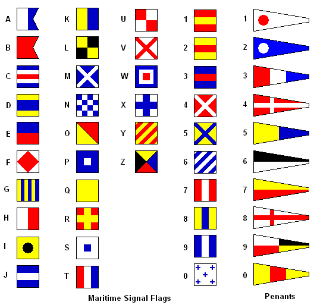

<!-- Encodings are not always 1:1, the same thing representation can mean multiple things -->

<!-- C Charlie = Affirmative when used alone -->

---


<!-- Encodings don't have to be text, it's generally used for any information -->

---

```text
M   O   R   S  E          C    O   D  E
−− −−− ·−· ··· · (space) −·−· −−− −·· ·
```

- Three letters: $\{ \_, ., EOW \}$
- Variable-width letters

---

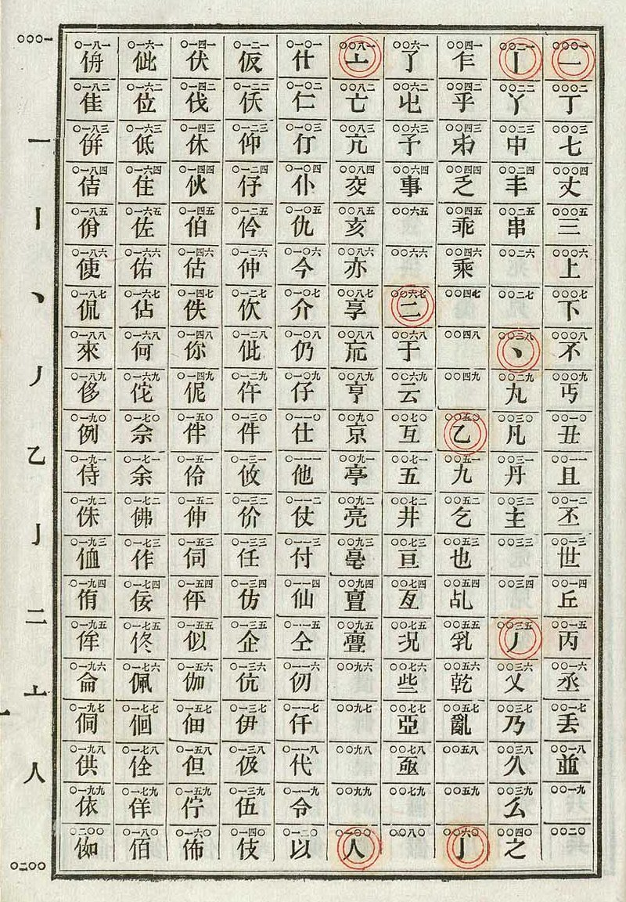

---

```text
電   碼

7193 4316
--... .---- ----. ...-- / ....- ...-- .---- -....

EGL  EWS
. --. .-.. / . .-- ...
```

<!-- Same look, different encodings, different lengths
The **_code point_** (電 $=$ 7193) is not the **_encoding_** (morse) -->

---

# Don't use `character` when discussing Unicode

- ~~Character: `a`, `e`, `1`, `電`, etc.~~

- Grapheme: a horizontally segmentable unit of text

- Codepoint: mapping of a character to some value

- Encoding: a collection of codepoints

- Glyph: visual representation

---

## ASCII

```
   00 NUL    20      40 @    60 `
   01 SOH    21 !    41 A    61 a
   02 STX    22 "    42 B    62 b
   03 ETX    23 #    43 C    63 c
   04 EOT    24 $    44 D    64 d
   05 ENQ    25 %    45 E    65 e
   06 ACK    26 &    46 F    66 f
   07 BEL    27 '    47 G    67 g
   08 BS     28 (    48 H    68 h
   09 HT     29 )    49 I    69 i
   0A LF     2A *    4A J    6A j
   0B VT     2B +    4B K    6B k
   0C FF     2C ,    4C L    6C l
   0D CR     2D -    4D M    6D m
   0E SO     2E .    4E N    6E n
   0F SI     2F /    4F O    6F o
   ⋮         ⋮        ⋮       ⋮
```

http://www.catb.org/esr/faqs/things-every-hacker-once-knew/

<!-- - 1963
- American Standard Code for Information Interchange
- 7-bit (8ᵗʰ bit used for parity)
- $2^7 = 128$ possible values
- Has a method to its madness! -->

---

[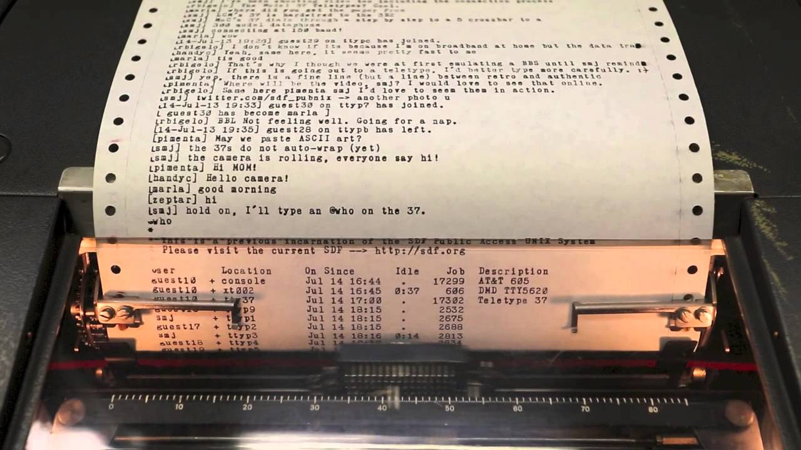](https://youtu.be/MikoF6KZjm0?t=289)
https://youtu.be/MikoF6KZjm0?t=289

<!-- This is the era of ASCII -->

---

## ASCII

- 0&ndash;31 are control characters `NUL` `CR` `LF` `DEL`
- 32&ndash;126 are punctuation, numerals and letters
- `␣` in binary: `0100000` $=$ 32 $=$ 0x20
- `A` in binary: `1000001` $=$ 65 $=$ 0x41
- `a` in binary: `1100001` $=$ 97 $=$ 0x61
  - $=$ 65 $+$ 32
    _ $=$ 0x41 $+$ 0x20
    _ $=$ `1000001 | 0100000`

<!-- Design makes it easy to uppercase text, and common characters are easily encoded -->

<!-- That's cool and all, but I want more -->

---

## Modified ASCII

- Extended ASCII (8-bit, has more characters `Ç` `ü` `▒` `¶` `æ`)
- Modified 7-bit ASCII exist
  - `#` → `£` on UK teletypes
  - `\` → `¥` in Japan (Shift-JIS)
  - `\` → `₩` in Korea (EUC-KR)

---

## Control characters

- `CR` Moves the print head to the left margin
- `LF` Scrolls down one line
- `DEL` Backspace and delete
- `ETX` `^C` (SIGINT)
- `EOT` `^D`
- `BEL` Rings the (physical) bell

```
sleep 3 && echo $'\a'
```

---

# ASCII ⇔ Unix/Linux _control_ codes

```
   Hex   Char                      Hex   Char
───────────────────────────────────────────────
   00    NUL '\0' (null character) 40    @
   01    SOH (start of heading)    41    A
   02    STX (start of text)       42    B
   03    ETX (end of text)         43    C 👈
   04    EOT (end of transmission) 44    D 👈
   05    ENQ (enquiry)             45    E
   06    ACK (acknowledge)         46    F
   07    BEL '\a' (bell)           47    G
   08    BS  '\b' (backspace)      48    H 👈
   09    HT  '\t' (horizontal tab) 49    I
   ⋮
```

`man ascii`

<!-- When you press CONTROL+C, you get ETX! And how is that different from  -->
<!-- Type some text into your terminal, and try H, or G -->

---

## So, what’s the problem with ASCII?

---

```
ASCII
^
```

---

## Problems with ASCII

- Latin-centric
- Everybody else came up with their own encodings
- Alternative ASCII sets cause problems with interchange
- Mojibake (<ruby>文字 <rt>moji</rt></ruby><ruby>化け<rt>bake</rt></ruby>): JIS, Shift-JIS, EUC, and Unicode
- No emoji, only emoticons :-(

---

## Dark ages

- ???
- ???
- ???
- ???
- ???
- ???

---

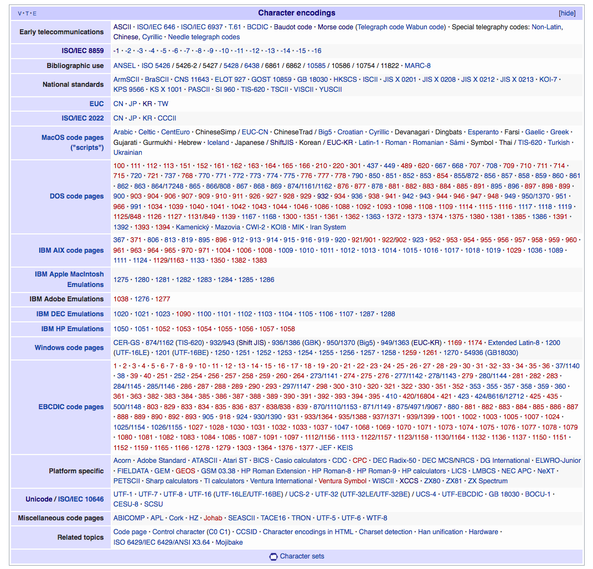

---

# [Part 2: Unicode](#unicode)

---

## Timeline of Unicode

- 1985, Sapporo, 🗾
- KanjiTalk, localised 🍎
- Shift-JIS is a 💩
- Bunch of 👷 start working on Unicode specs
- 1988, submitted to ISO 📰
- 1991, Han Unification accepted 🤔
- 1992, 👋 _Kiss Your ASCII Goodbye_ in _PC Magazine_
- 1995, ☕ Java 1.0 launches with Unicode support

http://www.unicode.org/history/earlyyears.html

---

[The first Unicode TV interview (1991)](<i/unicodeMOV%20(Converted).mov>)
http://www.unicode.org/history/unicodeMOV.mov

---

In that video, the VP of Unicode made:

- three statements
- three inaccuracies (in 2017)

---

[Unicode: the Movie (2000)](<i/UniMovie-large%20(Converted).mov>)
http://www.unicode.org/history/movie/UniMovie-large.mov

---

## Unicode features\*

- A common representation for all characters
- $\simeq$ Compatible with ASCII for English (`A` $= 65$)
- Efficient encoding
- ~~Uniform width encoding~~
- Han unification (CJK languages share glyphs)

---

## Unicode 13.0 (2020 March 10)

> Unicode 13.0 adds 5,930 characters, for a total of 143,859 characters.

https://unicode.org/versions/Unicode13.0.0/

> 55 new emoji characters

http://www.unicode.org/reports/tr51/tr51-12.html#Emoji_Counts

_&hellip;and more_

<!-- Unicode is a living, human process, and anyone can submit proposals, you can check them out on the website -->

---

## Unicode terminology

- Scalar value `€ U+20AC EURO SIGN`
- Range `U+0000..U+FFFF`
- Sequence `É <U+0045 LATIN CAPITAL LETTER E, U+0301 COMBINING ACUTE ACCENT>`

---

## Unicode planes

- `U+0000..U+FFFF` is Plane 0, Basic Multilingual Plane (BMP)
- Each plane encodes up to $2^{16} = 65536$ code points
- Commonly used characters

---

## Standard

Unicode

## Encoding

UTF-8, UTF-16, UTF-32, UCS-2, UCS-4

(UTF = Unicode Transformation Format)

---

## UTF-16

- Early UTF-16 was fixed-width (UCS-2)
- 2 or 4 bytes per character
- 2 bytes for characters in BMP
  - Can be more efficient than UTF-8 for CJK (2B vs 3B)
- Surrogate pairs have to be handled for code points outside BMP
  - Byte-order matters

---

## UTF-32

- 32 bits ought to be enough for anybody

---

## UTF-32

- `A` now takes up 4 bytes

---

## SCSU

_But wait! There’s more!_

### 🗜 Standard Compression Scheme for Unicode 🗜

http://www.unicode.org/reports/tr6/

---

## SCSU

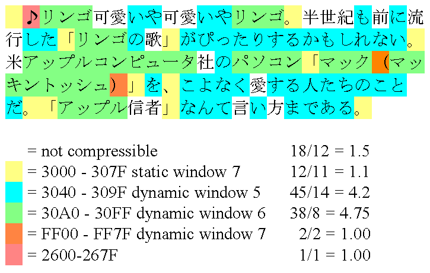

- Do not use it\*

---

## UTF-8

- Variable width

- Single-byte (Same as ASCII, 7-bits)
  ```
  00100100
  └ Is single-byte
  ```
  $=$ 36 $=$ 0x24 = `$ U+0024 DOLLAR SIGN`

---

## UTF-8

(The good one)

---

## UTF-8

- Multi-byte
  ```
  1110aaaa 10bbbbbb 10cccccc
  │├┘      ├┘       ├┘
  ││       └ Is continuation byte
  ││
  │└ 2 continuation bytes
  └ Is multi-byte
  ```
- First byte specifies number of continuation bytes
- Encoded character is `aaaabbbb` `bbcccccc`

---

# Unicode features

---

## Combining characters

- Modify other characters
  `e` $+$ `́ ` $=$ `é`

  `<e U+0065 LATIN SMALL LETTER E,`
  `U+0301 COMBINING ACUTE ACCENT>`

- Modifiers come after base character

---

## Combining characters

- Precomposed `é`
  `é U+00E9 LATIN SMALL LETTER E WITH ACUTE`

`é` $\neq$ `é`?

`é` $=$ `é`?

<!-- Are these the same? Turns out, it's complicated. -->

---

## Unicode normalisation

- Some combined characters are the same, sometimes

```js
()"e" + "́") === "é"
// => false

("e" + "́").normalize() === "é"
// => true
```

---

## Unicode normalisation mumbo jumbo

- Equivalence criteria
  - canonical (NF)
  - compatibility (NFK)
- `ffi` `U+FB03 LATIN SMALL LIGATURE FFI` vs `f` `f` `i`
  - not equivalent under canonical (NF)
  - equivalent under NFK compatiability (NFK)

<!-- Don't worry about this slide -->

---

## Unicode normalisation

- NFD _Normalization Form Canonical Decomposition_
- NFC _Normalization Form Canonical Composition_
- NFKD _Normalization Form Compatibility Decomposition_
- NFKC _Normalization Form Compatibility Composition_

NF is used to canonicalise combining characters

<!-- Just know that there are two ways to normalise -->

---

## Unicode normalisation is not the complete solution

# ✋ ✋🏻 ✋🏻 ✋🏿

---

## Emoji

- <ruby>絵 <rt>e</rt></ruby> (≅ picture) $+$ <ruby>文字 <rt>moji</rt></ruby>(≅ written character)
- Early emoji were created by Japanese telcos
- 2008: Gmail, iPhone
- 2010: Unicode 6
- 🈲 🈳 🈴 🈵 🈶 🈷️ 🈸 🈹 🈺 🆖 🆗 🉑 🈁 🈂️ 🌊 🎌 🎏

http://unicode.org/reports/tr51/

---

## Can be represented differently

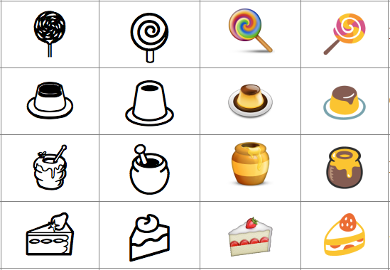

<!-- This is a problem -->

---

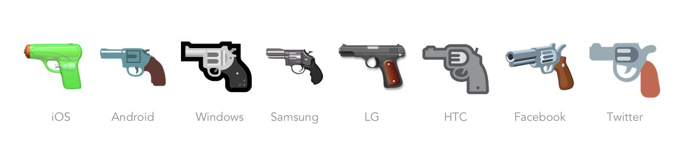

<span style="font-size: 96px">👦🔫</span>

---

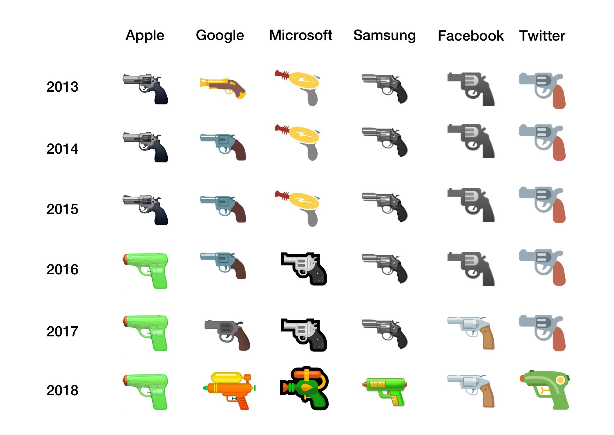

https://blog.emojipedia.org/google-updates-gun-emoji/

---

## Combining emoji

<div style="font-size: 96px">

👨 $+$ 👩 $+$ 👦 $=$ 👨‍👩‍👦

👪 $\neq$ 👨‍👩‍👦

</div>

`👪 U+1F46A FAMILY` vs combined character

---

<div style="font-size: 96px">

🇸 $+$ 🇬 $=$ 🇸🇬
🇬 $+$ 🇸 $=$ 🇬🇸

</div>

```text
🇸 < U+1F1F8 REGIONAL INDICATOR SYMBOL LETTER S >
🇬 < U+1F1EC REGIONAL INDICATOR SYMBOL LETTER G >
```

---

## Variation selectors

<div style="font-size: 96px">
🏻🏼🏽🏾🏿<br />
👦🏻👦🏼👦🏽👦🏾👦🏿👦

</div>

http://unicode.org/faq/vs.html

---

## Private use areas

- `U+E000..U+F8FF`, `U+F0000..U+FFFFD`, `U+100000..U+10FFFD`
- Suggested for internal use
  - data processing
  - artificial scripts
  - ancient scripts
-  `U+F8FF` (`⇧`-`⌥`-`k`)
- Ubuntu has `U+E0FF` and `U+F200`
  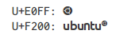

---

## Han unification

- aka. Unihan 數據庫, Unihan

- Maps common Chinese, Japanese, Korean (CJK) characters into unified set
  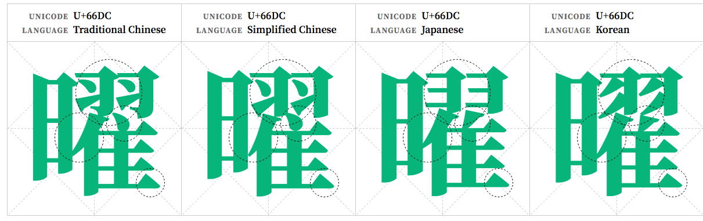
- Different countries have different standards

---

## Han unification

- Variants can be significant (names)
  <ruby>`芦`<rt>あし</rt></ruby> Ashi·da, given name vs Ashi·ya, old place name
  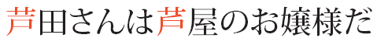

<!--
- Educational software
- People get 😡 over the differences
-->

---

## Han unification

> CJK Extension F contains mostly rare characters, but also includes a number of personal and placename characters important for government specifications in Japan, in particular.

CJK Extension F was added in Unicode 10.0 (2017)

---

## Han unification

- Lose round-trip conversion compatibility with character sets which have variants

https://support.microsoft.com/en-us/help/170559/prb-conversion-problem-between-shift-jis-and-unicode

---

## Rendering issues

### What could possibly go wrong?

`lang="zh"`

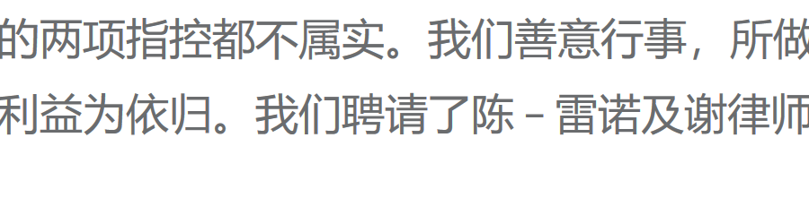

---

## Rendering issues

### Blank characters, mixed fonts, wrong glyphs

`lang="en"`

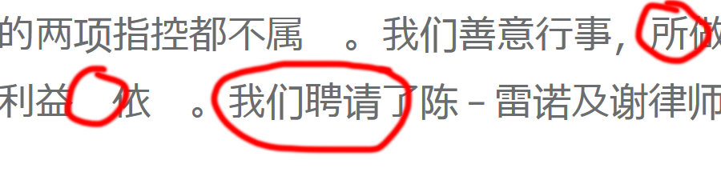

<!-- Language detection failed causing Firefox to pick the wrong font based off the language
The default font didn't have glyphs for some CJK characters, and the fallback stack didn't have the right glyphs either.
-->

---

## Variation selectors

- Can use Unicode variation selectors

  `U+E0101 VARIATION-SELECTOR-18`

  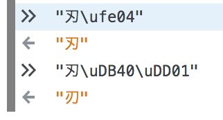

http://www.unicode.org/ivd/
http://unicode.org/reports/tr37/

<!-- This is also how your different-coloured emoji work -->

---

## Ligatures

> Unicode maintains that ligaturing is a presentation issue rather than a character definition issue

- But! There are some predefined ligatures
  `ffl U+FB04 LATIN SMALL LIGATURE FFL`
  `Ꜹ U+A738 LATIN CAPITAL LETTER AV`
  `æ U+00E6 LATIN SMALL LETTER AE`

- Similar issue with subscript and superscript

---

## Control sequences and vertical text

- Vertical text
- RTL mark
  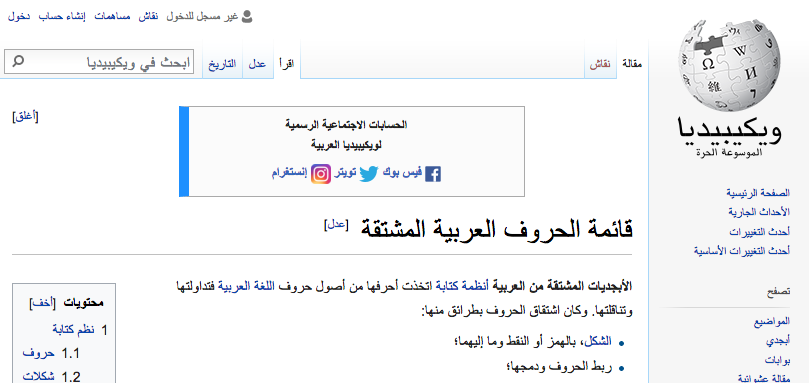

_Unicode Bidirectional Algorithm_ @ http://unicode.org/reports/tr9/
_Unicode Vertical Text Layout_ @ http://www.unicode.org/reports/tr50/

---

[EarthWeb commercial, 2001](i/EarthwebCommercial.avi)
http://www.unicode.org/history/EarthwebCommercial.avi

---

# 👨‍💻

# Part 3: Necessary

# but not necessarily sufficient

# programmer knowledge

# 👩‍💻

---

<div style="display: grid; grid-template-columns: 1fr 1fr 1fr; height: 100%; font-size: 128px; text-align: center">
<div>🦋</div>
<div>🐛</div>
<div>🐝</div>
<div>🐞</div>
<div>🐜</div>
<div>🕷</div>
<div>🦂</div>
<div>🦗</div>
<div>🦟</div>
</div>

<!-- Why should I care? -->

---

## “Bush hid the facts”

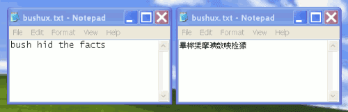

1. Type "Bush hid the facts"
2. Save the file
3. Open the file

https://en.wikipedia.org/wiki/Bush_hid_the_facts

<!-- Was a thing 15 years ago -->

---

`IsTextUnicode`

> Determines if a buffer is likely to contain a form of Unicode text.

---

## Recognise garbled text as mojibake

- Maybe able to recover content by swapping character sets
- UTF-8 seen using KOI8-R, a Cyrillic character set

  ```text
  п я─п╟п╨п╬п╥я▐п╠я─я▀
  ```

  UTF-8

  ```text
  Библиотека
  ```

---

## Use UTF-8 for all source code if possible

- Configure your text editor

---

## Magic comments for some older languages

### 💎 Ruby $\leq$ 1.9.x

```ruby
# encoding: UTF-8
```

### 🐍² Python 2

```python
# -*- coding: utf-8 -*-
```

---

### 💾 C $\leq$ C99

```
/* Dear future programmer: Good luck 👍 */
```

(Use a library, utf8proc seems to be popular)

---

## Text processing

- Treat input as bytes (if possible)

---

## Text processing

- Treat output as strings (and not byte arrays)

---

## Text processing

- Use UTF-8 wherever possible

---

## Text processing

- Decide what to do with invalid bytes
  - discard or substitute?
- Do not self-roll your own text encoding library

---

## Log streaming

```py
with open("mobydick-emoji-edition-🐋.utf8.txt", "rb") as input:
    while True:
        output_chunk = input.read(4096)
        if not output_chunk:
            #  EOF
            break
        #  Yield each chunk
        yield output_chunk
```

Where's the bug?

---

## Log streaming

```py
with open("mobydick-emoji-edition-🐋.utf8.txt", "rb") as input:  # 🐞
    while True:
        output_chunk = input.read(4096)  # 🐞
        if not output_chunk:
            #  EOF
            break
        #  yield each chunk
        yield output_chunk
```

<!-- A multibyte character at the chunk boundary could get cut off -->

---

## Read in text with the right encoding

Especially when parsing HTML or XML

```ruby
# Nokogiri
doc = Nokogiri.XML(html, nil, 'EUC-JP')
```

```python
# Beautiful Soup
soup = BeautifulSoup(html, fromEncoding='Shift_JIS')
```

<!-- watch out when web scraping -->

---

## Set HTML `charset`

```html
<!DOCTYPE html>
<html>
  <head>
    <meta charset="UTF-8" />
  </head>
</html>
```

---

## Use `lang` in HTML as needed

```html
<html lang="en">
  <body>
    <span lang="zh-Hans">刃</span>
    <span lang="zh-Hant">刃</span>
    <span lang="ja">刃</span>
    <span lang="ko">刃</span>
    <span lang="vi">刃</span>
  </body>
</html>
```

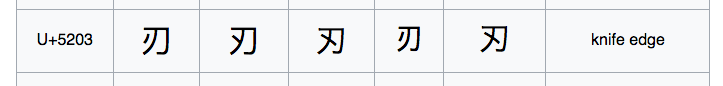

---

## Use `accept-charset` in forms as needed

```html
<form action="myform" accept-charset="UTF-8"></form>
```

Uses document charset by default

---

## Case conversion

- What is the uppercase form of `i`?

---

## Case conversion

- What is the uppercase form of `i`? `I`
- In Turkish?

---

## Case conversion

- What is the uppercase form of `i`?
- In Turkish?
  `ı` → `I`
  `i` → `İ`

---

## Case conversion

- What is the uppercase form of `i`?
- In Turkish?
  `ı` → `I`
  `i` → `İ`
- In Turkish/English mixed text?

---

## Case conversion

- Harder than you think
- What is the uppercase form of
  `ß U+00DF LATIN SMALL LETTER SHARP S`?

---

## Case conversion

- 🇩🇪 German
- `ß` upcases to `SS`

---

## Case conversion

- 🇩🇪 German
- `ß` upcases to `SS`
- …or `U+1E9E ẞ LATIN CAPITAL LETTER SHARP S`

http://unicode.org/faq/casemap_charprop.html

---

## Case conversion

> In 2016, the Council for German Orthography proposed the introduction of optional use of ẞ in its ruleset (i.e. variants STRASSE vs. STRAẞE would be accepted as equally valid).[9] The rule was officially adopted in 2017.[10]

---

## Does your favourite programming language work?

### 🔥 JavaScript (Firefox 53)

```javascript
>> 'ß'.toLocaleUpperCase('de-DE');
'ß' // (unchanged)
```

### 🔥 JavaScript (Firefox 73)

```javascript
>> 'ß'.toLocaleUpperCase('de-DE');
'SS'
```

### 🔮 JavaScript (Chrome 59)

```javascript
>> 'ß'.toLocaleUpperCase('de-DE');
'SS'
```

---

### 🐍² Python 2

```python
>>> u'ß'.upper()
u'\xdf'  # ß (unchanged)
```

### 🐍³ Python 3

```python
>>> 'ß'.upper()
'SS'
```

---

### 💎 Ruby 2.3

```ruby
> "\u{00df}".upcase
=> "ß" # (unchanged)
```

### 💎 Ruby 2.4

```ruby
> "\u{00df}".upcase
=> "SS"
```

---

### 🐻 Go

```go
package main

import (
	"fmt"
	"golang.org/x/text/cases"
	"golang.org/x/text/language"
)

func main() {
	c := cases.Upper(language.German)
	fmt.Println(c.String("ß"))
}

SS
```

<!-- If you have a better way of doing this, please let me know -->

---

### ☕ Java

```java
public class UppercaseThis {
    public static void main(String[] args) {
        System.out.println("\u00df".toUpperCase());
    }
}

SS
```

---

### ⚙️ Rust

```rust
fn main() {
    println!("{}", "ß".to_uppercase());
}

SS
```

<!-- The good news is modern versions handle this well -->

---

## Use variation selectors as needed

`U+E0101 VARIATION-SELECTOR-18`


---

## Use a correct font for the language outside HTML

- Google’s Noto/Noto CJK has great support
- Similarly, Adobe’s Source Han

https://www.google.com/get/noto/help/cjk/
https://source.typekit.com/source-han-serif

---

## Use a correct font for the language outside HTML

### Glyph variations

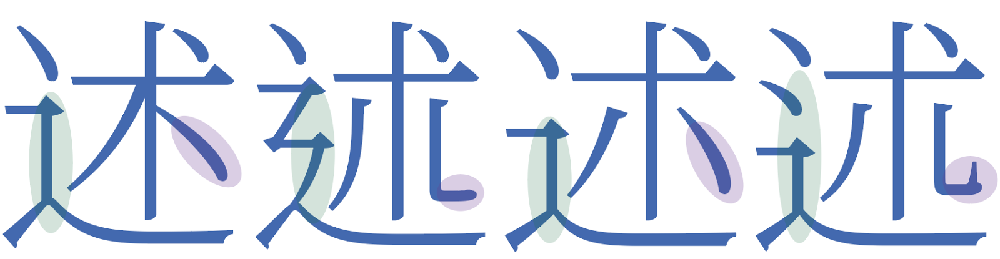

`述 U+8FF0` in S. Chinese, T. Chinese, Japanese and Korean
_Noto Serif CJK_

---

## Use a correct font for the language outside HTML

### Vertical text support

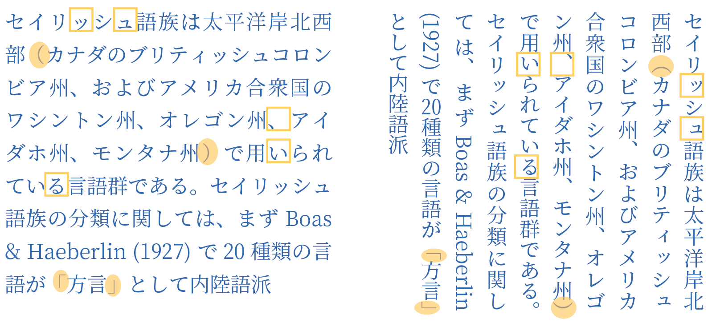
_Noto Serif CJK_

https://helpx.adobe.com/photoshop/user-guide.html?topic=/photoshop/morehelp/text.ug.js

---

## Unencoded characters

How can I display (CJK/my own) characters not encoded in Unicode?

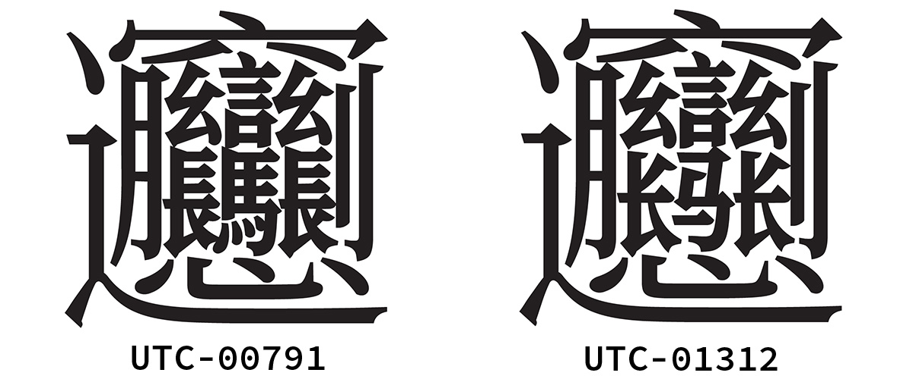

_biáng_, from _biángbiáng 面_, a noodle dish from Shaanxi, China

[Coming to a Unicode version soon?](http://www.unicode.org/L2/L2015/15225-uax45-addition.pdf)

---

## Unencoded characters

- Use an image
- Use Ideographic Description Sequences
  `⿰⿱⿲⿳⿴⿵⿶⿷⿸⿹⿺⿻ U+2FF0..U+2FFF`
  `⿰書史` for , a character of a dialect in China
- Use fonts which have the unencoded glyph either
  - as an existing character (Wingdings 🕴👽👓✇)
  - in Private Use Area
  - as a combined sequence

<!-- Sawndip, a dialect in China -->

---

## Unencoded characters

- Source Han and Noto have glyphs for _biáng_!
- Uses Unicode and font features to combine existing glyphs
  _ Ideographic Description Characters
  _ OpenType's `ccmp` (Glyph Composition/Decomposition) \* Ligatures `liga`

https://blogs.adobe.com/CCJKType/2014/03/ids-opentype.html

---

## Unencoded characters

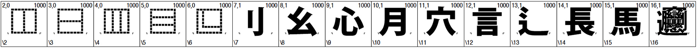

```
⿺辶⿳穴⿰月⿰⿲⿱幺長⿱言馬⿱幺長刂心 (traditional)
⿺辶⿳穴⿰月⿰⿲⿱幺长⿱言马⿱幺长刂心 (simplified)
```

https://blogs.adobe.com/CCJKType/2017/04/designing-implementing-biang.html

---


---

What _⿺ 辶 ⿳ 穴 ⿲ 月 ⿱⿲ 幺言幺 ⿲ 長馬長刂心 ⿺ 辶 ⿳ 穴 ⿲ 月 ⿱⿲ 幺言幺 ⿲ 長馬長刂心面_ looks like

---

## String sorting

```javascript
  >> 'e' > 'f'
  false

  >> 'f' > 'e'
  true
```

String comparison done in lexicographical order in JavaScript

---

## String sorting

- Sorting strings is hard!
  ```javascript
  >> 'é' > 'f'
  true
  ```

---

## String sorting

- The solution: normalisation

  ```javascript
  >> 'café'.normalize('NFKD')
  'cafe ́'
  ```

---

## String sorting

- Sometimes

  ```
  >> '한국어'.normalize('NFKD')
  "ᄒ ᅡ ᆫ ᄀ ᅮ ᆨ ᄋ ᅥ"
  ```

[MDN: String.prototype.normalize()](https://developer.mozilla.org/en/docs/Web/JavaScript/Reference/Global_Objects/String/normalize)

https://unicode.org/reports/tr10/#Hangul_Collation

<!-- I can't read Hangul, but according to the boffins this is not right. TLDR: edge cases -->

---

## String sorting and equality

- Use a locale-aware comparison

  ```javascript
  >> ['Aa', 'Äa', 'Äb', 'Ab'].sort();
     ['Aa', 'Ab', 'Äa', 'Äb']
  ```

  ```javascript
  >> ['Aa', 'Äa', 'Äb', 'Ab']
  >>   .sort(a, b => a.localeCompare(b, 'de'));
     ['Aa', 'Äa', 'Ab', 'Äb']
  ```

[MDN: String.prototype.localeCompare()](https://developer.mozilla.org/en/docs/Web/JavaScript/Reference/Global_Objects/String/localeCompare)

---

## String searching

- How do I search for `café` by typing `cafe`, or `cafe ́`?

---

## String searching

- Not easy!
- Locale-aware comparisons
- Unicode-aware regex

---

## String searching (proper)

- Read _Unicode Demystified: A Practical Programmer's Guide to the Encoding Standard_ by _Richard Gillam_
- Read http://unicode.org/reports/tr10/#Searching

---

## Concise bedtime reading

> The essential problem results from the fact that Hangul syllables can also be represented with a sequence of conjoining jamo characters and because syllables represented that way may be of different lengths, with or without a trailing consonant jamo.

<!-- Takeaway is that it's not easy to do it right -->

---

## Asymmetric searching

| query  | matches                                           |
| ------ | ------------------------------------------------- |
| resume | resume, Resume, RESUME, résumé, rèsumè, Résumé, … |
| résumé | résumé, Résumé, RÉSUMÉ, …                         |
| けんこ | けんこ, ケンコ, げんこ, けんご, ゲンコ, ケンゴ, … |

---

## String length

What's the length of `café`?

---

## String length

Problems arise when your string contains

- combining marks
- surrogate pairs (UTF-16)

---

## String length &mdash; combined characters

```javascript
>> 'café'.length
5

>> 'café'.normalize().length
4
```

```javascript
>> 'ユニコード'.length
5

>> 'ユニコート\u3099'.normalize().length
5
```

---

## String length &mdash; surrogate pairs

What's the length of `💩 U+1F4A9 PILE OF POO`?

- UTF-8
  `F0 9F 92 A9`
- Surrogate pairs (UTF-16)
  `D83D DCA9`

---

### 🔥 JavaScript

```javascript
>> '💩'.length
2
>> [...'💩'].length
1
```

---

### 🐍² Python 2

```python
>>> len(u'💩')
2
```

### 🐍³ Python 3

```python
>>> len('💩')
1
```

---

### 🐻 Go

```go
fmt.Println(len("💩")) // 4

fmt.Println(len([]rune("💩"))) // 1
```

---

### 💎 Ruby

```ruby
>> '💩'.length
1
```

---

### ⚙️ Rust

```rust
println!("{}", "💩".len());
// 4

println!("{}", "💩".chars().count());
// 1
```

---

### ☕ Java

```java
System.out.println("💩".length());
// 2

String s = "💩";
System.out.print(s.codePointCount(0, s.length()));
// 1
```

<!-- You can infer the internal representation of strings through length() -->

---

## String lengths

- What is the definition of the length of a string?
- What is a character?

---

## String lengths

- Bytes
- Codepoints
- Normalised codepoints
- ~~Characters~~

```go
fmt.Println(len([]rune("🏴‍☠️")))  // => 4
```

---

## String length: graphemes

```js
// rich text formatting
{
  value: "a𫝜👍🏽c",
  annotations: [
    {
      index: 1,
      length: 1,
      name: "strikethrough"
    }
  ]
}
```

Expected output: a~~𫝜~~c

What does `length: 1` even mean?

---

## String length: graphemes

"a 𫝜 👍🏽c".length
`// => 8`

[..."a 𫝜 👍🏽c"].length
`// => 5`

Wait, what?
Remember: combining characters

---

## String length: graphemes

Don't use "character" length!

Use _grapheme clusters_

grapheme cluster: a user-perceived character

https://unicode.org/reports/tr29/

---

### 🔥 JavaScript

```js
const segmenter = new Intl.Segmenter("en", { granularity: "grapheme" });
const str = "a𫝜👍🏽c";
[...segmenter.segment(str)].length;
// 4
```

https://developer.mozilla.org/en-US/docs/Web/JavaScript/Reference/Global_Objects/Intl/Segmenter

---

## String length: graphemes

### ⚙️ Rust

```rs
use unicode_segmentation::UnicodeSegmentation;

fn main() {
    let graphemes = "a𫝜👍🏽c".graphemes(true).collect::<Vec<&str>>();
    assert_eq!(g.count(), 4);
}

```

https://github.com/unicode-rs/unicode-segmentation

---

## Characters

- Do not think about strings in terms of characters
- Characters are not your friends
- Use byte, grapheme cluster, codepoint&hellip;

---

## Regex

- What if you want to match `e` and `é`?
- What about all the different whitespace characters?
- What if I want to match one character `/^.$/` but my character is combined? `é` $\neq$ `e` $+$ `´`
- What about matching non-Latin characters?

---

## Regex

- Use Regex right
- Make sure `\w` `\d` `\s` are Unicode-aware
- Make sure your Regex engine does [case-folding](ftp://ftp.unicode.org/Public/UNIDATA/CaseFolding.txt)
- Match by Unicode (Perl)
  - `\N{}` Named or numbered (Unicode) char or sequence
  - `\o{}` Octal escape sequence.

---

## Regex

- In Perl, you can use `\X`

  > `\X` Unicode "extended grapheme cluster". Not in [].

- You can use Regex ranges with code points
- You might be able to match by Regex classes (Perl, Rust)
  ```rust
  let re = Regex::new(r"[\p{Greek}]+").unwrap();
                         👆
  ```

http://www.unicode.org/reports/tr18/

<!-- Generally you won't need this, but it's good to know :+1: -->

---

## Emoji

- Combinations or new emoji might not be supported
  - `🤮 U+1F92E FACE VOMITTING` (Emoji 5.0, 2017)
  - `🤷‍♂️ <U+1F937 SHRUG, U+2642 MALE>` (Emoji 4.0, 2016)
  - `🐱🐉 Ninja Cat riding T-Rex` (Windows 10 only)
    

---

## Emoji

- Replace emoji with images (GitHub, Twitter)
  - https://github.com/twitter/twemoji
- Use (coloured) emoji fonts
  - https://github.com/eosrei/emojione-color-font
  - https://github.com/googlei18n/noto-emoji
- Let it be
  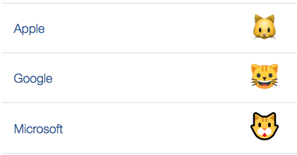

---

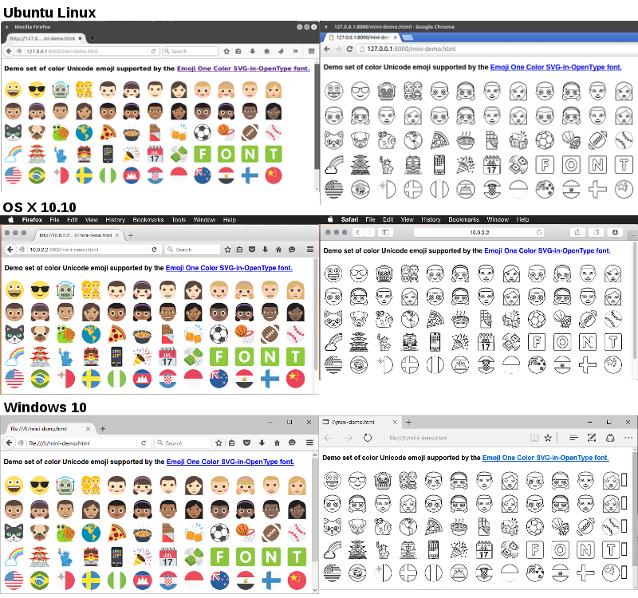

---

## Emoji bugs

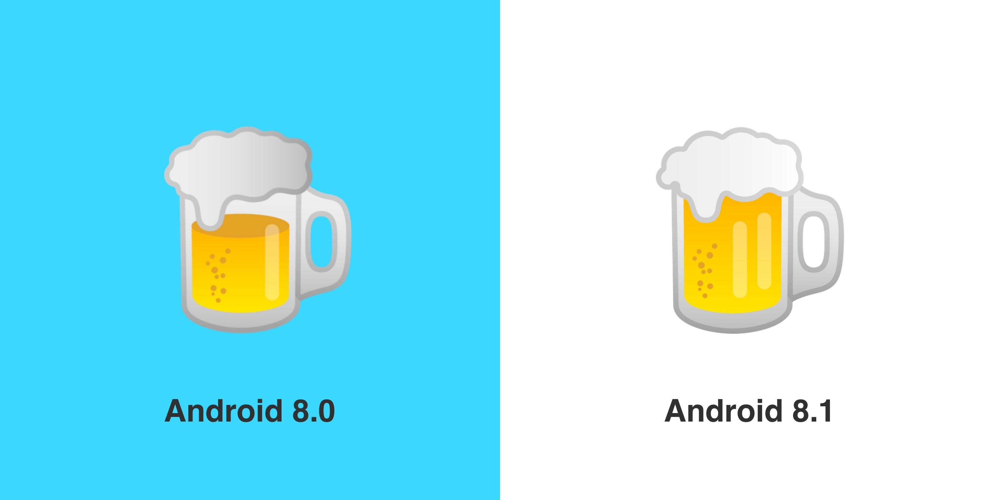

https://blog.emojipedia.org/google-fixes-burger-emoji/

---

## Developing for Unicode

If you ever need to develop Unicode parsing and processing, use the CLDR database, and read the reports

http://cldr.unicode.org/

---

## Email

Set the MIME needed for Unicode if your library doesn't handle it for you

```py
msg = MIMEText('€10'.encode('utf-8'), _charset='utf-8')
```

https://docs.python.org/3.1/library/email.mime.html#email.mime.text.MIMEText

https://en.wikipedia.org/wiki/Unicode_and_email

<!-- No discussion is complete without email -->

---

# 🚨 Security 🚨

Read _Unicode Security Considerations_
@ http://www.unicode.org/reports/tr36/

---

## Restrict passwords and user names to ASCII

- For logistical reasons (customer support)
- Unicode normalisation of passwords can cause problems
- Equivalent characters
  `e` $+$ ``$\neq$`é`
- Basic authentication can fail in different browsers
- Keyboard issues

---

## Sanitise text input

- How would you do it?

---

## Sanitise text input

- 𝕯𝖎𝖋𝖋𝖎𝖈𝖚𝖑𝖙 𝖕𝖗𝖔𝖇𝖑𝖊𝖒.

---

## 𝓓𝓲𝓯𝓯𝓲𝓬𝓾𝓵𝓽 𝓹𝓻𝓸𝓫𝓵𝓮𝓶.

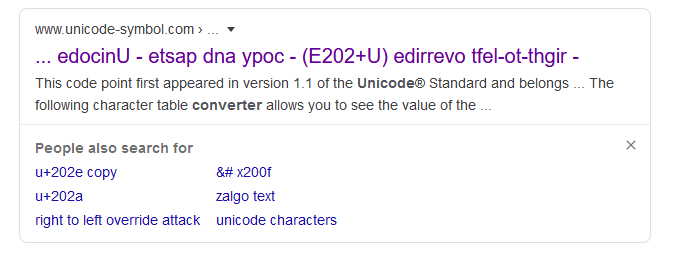

<!-- Even google doesn't quite do it -->

---

## Sanitise text input

- “Unicode injection”: RTL, combining characters, wide characters
- `﷽` is one (1!) character
  `U+FDFD ARABIC LIGATURE BISMILLAH AR-RAHMAN AR-RAHEEM`
- Z̤̲̙̙͎̥̝A͎̣͔̙͘L̥̻̗̳̻̳̳͢G͉̖̯͓̞̩̦O̹̹̺!̙͈͎̞̬
- 25 different whitespace characters
- Non-printing characters

https://github.com/minimaxir/big-list-of-naughty-strings

---

## Unicode control characters

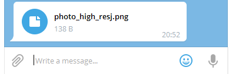

`photo_high_re` $+$ `U+202E 'RIGHT-TO-LEFT OVERRIDE'` $+$ `gnp.js`

---

## Unicode in URLs

Visit [`https://www.xn--80ak6aa92e.com/`](https://www.xn--80ak6aa92e.com) in your browser

---

## Unicode in URLs

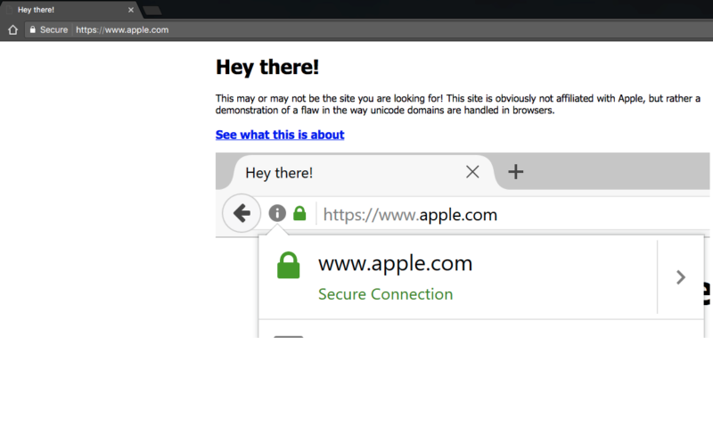

---

## Unicode in URLs

`https://www.аррӏе.com/`

|     |                                         |
| --- | --------------------------------------- |
| `а` | `U+0430 CYRILLIC SMALL LETTER A`        |
| `р` | `U+0440 CYRILLIC SMALL LETTER ER`       |
| `ӏ` | `U+04CF CYRILLIC SMALL LETTER PALOCHKA` |
| `е` | `U+0435 CYRILLIC SMALL LETTER IE`       |

https://www.xudongz.com/blog/2017/idn-phishing/

---

## Unicode in URLs

- Handing legit Unicode in URLs
  ```
  http://Bücher.de
  → http://xn--bcher-kva.de
  → http://bücher.de
  ```
- Punycode, ASCII representation for Unicode domain names (IDN)

http://www.unicode.org/reports/tr46/

---

## Free pizza!

```text
Title: Free Pizza Fridays!
From: HR
To: You

Happy Friday!

Visit https://mom.gov.sg⁄free.pizza to claim a FREE 🍕!

FYNAP
- HR
```

This message could be a scam. [Report] [Ignore]

---

## Unicode in URLs

`⁄ U+2044 FRACTION SLASH`

```text
Visit https://mom.gov.sg⁄free.pizza to claim a FREE 🍕!
                         👆
```

🍕 `sg⁄free.pizza` 🍕

---

## Unicode in URLs

Solution: Use Punycode where/when it makes sense to

```text
Visit https://mom.gov.xn--sgfree-qq0c.pizza to claim a
FREE 🍕!
```

---

> Company: GitHub
>
> Vulnerability: Password reset emails delıvered to the wrong address.
>
> Cause: Forgot password emails validated against lowercase value on file, but sent the provided email.

https://dev.to/jagracey/hacking-github-s-auth-with-unicode-s-turkish-dotless-i-460n

---

```js
// Note the Turkish dotless i
"John@Gıthub.com".toUpperCase() === "John@Github.com".toUpperCase();
```

https://bounty.github.com/researchers/jagracey.html

---

> GitHub's forgot password feature could be compromised because the system lowercased the provided email address and compared it to the email address stored in the user database.

But they sent emails to the un-normalisedtransformed email!

<!-- Ironically, doing lowercase right gave them problems! -->

---

Be careful when normalising or transforming unique identifiers!

### 🐍³ Python 3

```python
>>> "John@Gıthub.com".upper() == 'JOHN@GITHUB.COM'
True
```

`ı U+0131 LATIN SMALL LETTER DOTLESS I`

---

## [Click here]() for one neat trick to ruin bad software!

- MySQL UTF-8

  What happens when the _valid_ UTF-8 string

  ```text
  👽 U+1F47D EXTRATERRESTRIAL ALIEN
  ```

  is inserted into a column of

  ```sql
  VARCHAR CHARACTER SET utf8
  ```

---

## Ill-formed sequences and encoding mismatches

- MySQL $\lt$ 5.5.3 (2010) UTF-8

  ```text
  Incorrect string value: ‘\xF0\x9F\x91\xBD…’ for
  column ‘data’ at row 1
  ```

  In MySQL, use `utfmb4` ($\geq$ 5.5.3, 2010)

https://mathiasbynens.be/notes/mysql-utf8mb4

---

##

<div style="font-size: 200px">👽</div>

4 bytes long! `0xF0 0x9F 0x91 0xBD`

---

## Ill-formed sequences and encoding mismatches

- 🐍² Python 2

  ```python
  >>> '\x81'.decode('utf-8')
  # UnicodeDecodeError: 'utf8' codec can't decode byte
  # 0x81 in position 0: unexpected code byte
  ```

- 💎 Ruby 1.9

  ```ruby
  'ü'.encode('ISO-8859-1') + 'ü'
  # incompatible character encodings: ISO-8859-1 and
  # UTF-8 (Encoding::CompatibilityError)

  # or sometimes: invalid multibyte char (US-ASCII)
  ```

Solution: use languages/libraries which handle Unicode right

---

## Buffer overflows

- Do not assume Unicode strings are of fixed-length

  ```
  Fluß → FLUSS → fluss
  ```

  ```
  >> 'ﷺ'.length
  1

  >> 'ﷺ'.normalize('NFKC').length
  18
  ```

Solution: use languages/libraries which handle Unicode right

---

## OS/locale filenames

- Beware simple filename sanitisation, especially on Windows
- Normalization of paths
  `ｃ：＼ｗｉｎｄｏｗｓ` becomes `c:\windows`
- Character mappings
  `¥` is mapped to `\` on a Japanese-language Windows system

https://msdn.microsoft.com/en-us/library/dd374047(v=vs.85).aspx

---

```
> 1 + 1;
← 2

> 1 + 1&#894;
       👆
← 🚨 SyntaxError: illegal character 🚨
```

---

`; U+037E GREEK QUESTION MARK`

<!-- Takeways

1. Unicode is COMPLICATED
2. Strings are HARD
3. Be AWARE and ask yourself whenever you're doing something with strings

-->

---

# Rust

```
error: unknown start of token: \u{37e}
 --> src/lib.rs:1:14
  |
1 | let x = 1 + 1;
  |              ^
  |
help: Unicode character ';' (Greek Question Mark) looks like ';' (Semicolon), but it is not
  |
1 | let x = 1 + 1;
  |              ^                 ^
```

[A list of similar characters](https://github.com/rust-lang/rust/blob/master/src/librustc_parse/lexer/unicode_chars.rs)

---

## Resources

<small>

- [The Unicode Standard (latest)](http://www.unicode.org/versions/latest/)
- [Unicode publications](http://www.unicode.org/publications/)
- [Unicode technical reports](http://www.unicode.org/reports/)
- [Unicode data files](http://www.unicode.org/onlinedat/online.html)
- [Unicode public files](http://unicode.org/Public/)
- [Emoji charts](http://www.unicode.org/emoji/charts/index.html)
- [Emoji slides](http://www.unicode.org/emoji/slides.html)
- [Unicode character inspector](https://apps.timwhitlock.info/unicode/inspect)
- [UTF-8 decoder](http://software.hixie.ch/utilities/cgi/unicode-decoder/utf8-decoder)
- [Big List of Naughty Strings](https://github.com/minimaxir/big-list-of-naughty-strings)
- [Personal names around the world](https://www.w3.org/International/questions/qa-personal-names)
- [Falsehoods Programmers Believe About Phone Numbers](https://github.com/googlei18n/libphonenumber/blob/master/FALSEHOODS.md)
- _Unicode Demystified: A Practical Programmer's Guide to the Encoding Standard_ by Richard Gillam

</small>
