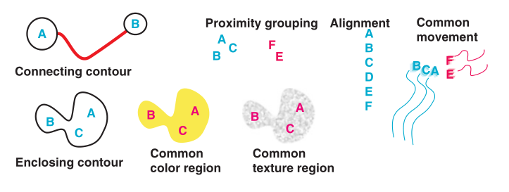
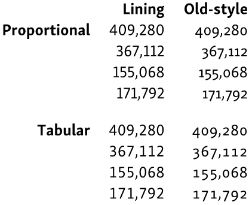
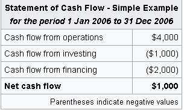

# Web typography basics

###### August 2020

<!-- Main goal is less design, more implementation tips
Give you some motivation, and some tips to takeaway
Short presentation, won't cover everything. -->

---

# Design, not art

<!-- Here I'm preaching purpose of typography. -->

---


<!-- Design, not art What's the difference?
Depends on your philosophy, but in general design serves a purpose, and art does not necessarily have to


Calligraphy is interesting as an art form, but it is not typography
I can't read Arabic, but arabic calligraphy is interesting enough to spend a few hours reading up on
Calligraphy traditions persist in typography

-->

---

# Content is king

<!-- Typography serves its content -->

---


<!-- If you aren't a lawyer, it does not matter how amazing the typesetting is, you aren't ever going to read it

However, if your aim is to make users skip the EULA, then you could make it as unappealing as possible
-->

---

## Fit for purpose

0. Purpose

1. Readability

2. Tone

   ⋮

3. Aesthetics

---


<!-- There is a purpose to design
Dictionary for scanning, searching
  Headings on each page
  Page number (index)

Dictionary entries are concise
Dictionary entires link to other entries
-->

---


Slide from OpenBSD on OpenSSL code quality

<!-- Again, I'm not here to talk about picking fonts, but consider this example -->
<!-- It's a slide from OpenBSD on OpenSSL code quality. -->
<!-- It's quite fashionable to have an innate revulsion towards Comic Sans MS. Why? Cultural? -->
<!-- If you have two typefaces to pick (Arial, CS), which would you pick for your child's birthday party invites? It changes the tone. -->

---

<!-- Now that we've gotten the wilhelm scream of typography out of the way. Hopefully by this point I've somewhat convinced you that typography has an effect on your content. But why does it have an effect? -->

# Typography $\subset$ Visual design

---

## Humans are flawed?

Not the focus, but text is for human consumption

<!-- Humans are cultured organisms -->

---


<!-- What does this make you think of? -->
<!-- For me, retrofuturism, modernism -->

---


<!-- For others, Ikea? -->
<!-- Part of this is cultural, but  -->
<!-- Text is to be consumed by wetware, and so we have to design for the human -->

---


<!-- Notice how your eye actually goes to the grey box at the side -->

---


<!-- Colour processing is hardware-bound in humans -->

---



<!-- Humans have hardware for lines, shapes, and movement -->
<!-- This is not a typography presentation, so I'll skip along -->

---

# Web typography

<!-- Has come a long way since 1993 -->

---

- Latin/English focus
- Focus on the web

<!-- Practical tips for the web. Other platforms have very different requirements. 3D, for example, has very different font considerations -->

---

- Hierarchy
- Spacing
- Colour
- Weights
- Typefaces
- Alignment
- Kerning
- Letter spacing
- Rhythm
- Widows
- Orphans
- Rivers
- Justification
- Punctuation
- Tables

<!-- So today's contents... or not. I'm not here to instruct on typography fundamentals, but to give some tips and best practices that you can apply today -->

---

## The boring stuff

- `<html lang="en">`
- quotation marks `<q>quoted</q>`
- line breaks `<wbr>` `word-break` `whitespace` `&nbsp;`
- dashes `&mdash;` `&ndash;`
- ellipsis `&hellip;`
- `h1` `h2` `h3` &hellip; `p` `small`
- `widows` `orphans` `columns` `unicode-range`

<!-- For Bedrock, we have a linter set up for some of these more "tactical" detail adjustments. For ellipsis (dot dot dot), we scan through all the text of Bedrock UI and fail you if you use it -->

---

## Fonts

```
@font-face {
  font-family: "Noto Sans";
  src: url("fonts/subset-NotoSans-Bold.woff2") format("woff2");
  font-weight: 700;
  font-style: normal;
}

@font-face {
  font-family: "Noto Sans";
  src: url("fonts/subset-NotoSans-BoldItalic.woff2") format("woff2");
  font-weight: 700;
  font-style: italic;
}
```

```
<link href="https://fonts.googleapis.com/css2?family=Open+Sans:wght@300;400&display=swap" rel="stylesheet">
```

---

## Font vs Typeface

In simple terms for the digital age

> Typeface: design
> Font: implementation

---

## Font sizes

CSS `<length>`

| Unit       |                                               |
| ---------- | --------------------------------------------- |
| px         | CSS pixel                                     |
| pt, pt     | 1pt usually 1/72in                            |
| cm, mm, in |                                               |
| %          |                                               |
| rem        | font size of the root element, usually `html` |
| em         | font size of the element, compounding         |

---

## Font sizes (part 2)

CSS `<length>`

| Unit |                                       |
| ---- | ------------------------------------- |
| ch   | width of `0`                          |
| vw   | viewport width                        |
| vh   | viewport height                       |
| vmin | min of viewport width, height         |
| vmax | max of viewport width, height         |
| ex   | x-height of the font, usually ≈ 0.5em |

<!-- What do I use? There are so many -->

---


---

## #1 Use relative units by default

em, rem

---

## #2 Avoid viewport units

- Especially `vh` as it changes on scroll (especially on mobile).
- Fixes to viewport size, hard to zoom

<!-- Recent years, "responsive" type -->

---

## Font formats

- Bitmap
- TTF
- PS
- OTF
- SVG
- WOFF
- WOFF2
- EOT

In general, go for OTF wrapped in WOFF2

---

## Font stack

- Pick a good font stack

  - `MyFont, SystemFont, serif;`

- This has to be part of the design

---


<!-- - Browser algorithms are bad -->

---

## Text justification

`text-align` `text-justify`

- Avoid `text-align: justified` in CSS, leave it ragged right (ie. unjustified)
- Especially for narrow columns

---

## `font-display`

- Controls swapping in fonts as they load, or whether fonts should even load
- Avoid flash-of-unstyled-text when possible.
- Avoid content reflow.

---

## `font-feature-settings` and friends

- Some OTF fonts have features you can turn on or off
- Most importantly
  - Standard ligatures `liga`
  - Tabular figures `tnum`
  - Kerning `kern`

---

## Ligatures

- Combined characters
- Turn off for monospace `font-variant-ligatures: none;`
- Turn off if letter spacing has been adjusted

---


---

## Kerning

- Automatic (optical spacing)
- `font-feature-settings: kern` to use (metrics spacing, font-supplied)
- Control only when needed with `letter-spacing`

  

<!-- Remember when I mentioned text is for humans? Kerning is all about optical illusions and spaces between characters. -->

---


<!-- Look at the A and the U -->

---

## Font hinting

- Instructions on how to scale down or up a font
- Check for rendering bugs across platforms

  
  

---


<!-- Bug in ampersand hinting of Source Code Pro -->
<!-- https://github.com/rust-lang/rust/issues/16372 -->

---

## `font-smooth`

- Avoid
- Let the OS control it
- Higher density screens are reducing need for this

---

## Self-host vs Google Fonts

|      | Self-host              | Web service             |
| ---- | ---------------------- | ----------------------- |
| Good | Content on your server | Content on their server |
| Bad  | Content on your server | Content on their server |

---

## Self-host


- Optimise (Noto is 500KB per weight!)
  - glyphhanger, fontmin
- Subset fonts
- Add `rel="preload"` to font `<link>` tags

---

## Variable fonts


---

Reduces number of font variant files to download


<!-- Reduces webpage size = faster loads = good! -->

---

## Colour fonts


---

## Tables


---


- Left-align text, right-align numbers, align decimals
- Easy way out is to use fixed-precision decimals

---


- Align numbers to decimal if possible
- Add spacing between groups

<!-- Humans are good at visual groups -->

---

## Tables

- Use tabular figures `font-feature-settings: tnum`

  

---

## Emoji

- Replace with image (Twitter)
- Let OS render
- Use an emoji font

---

## Print stylesheets

### Add URL to links

```css
a[href]:after {
  content: " (" attr(href) ")";
}
```

### Set verso (left) page styling

```css
@page :left {
  margin-right: 200pt;
}
```

<!-- Many tricks can be done, but debugging and browser support is bad -->

---

## Emails


- Keep it simple, avoid custom fonts
- Personally, I prefer plain text emails
- Check https://www.caniemail.com/

---

## Font weights and interaction

```css
button:hover {
  font-weight: bold;
}
```

- Avoid changing font widths with interactivity
- This causes content sizes to change and causes a content shift

---

## Secret technique: `font` shorthand

```css
.text {
  --my-font: "Fira Sans", sans-serif
  font: 1.2em var(--my-font);
}
```

---

## Language and culture

Stick to convention, use appropriate punctuation




---

Consider language density and adjust font sizes if needed


(Salesforce Lightning design system )

---

## CJK fonts

- Unicode Han unification
- Use the right font
- Set `lang` attribute

---

- Pick a good font stack, especially for mixed-languages
  Electron apps (Slack, Discord) are notoriously bad for this
  

---

## Vertical, RTL, Ruby


---

# Everyone is disabled

- Or will soon be&hellip;

---

- Astigmatism (30&ndash;60%)
- Presbyopia (25%, definite with age)
- Myopia (22%, higher in Asians)
- Cataract (17%)
- Hyperopia (7.5%)
- Colour-blindness (♂8%, ♀0.5%)
- Dyslexia (3&ndash;7%)
- Blind (2&ndash;8%, depending on age)
- Small screen
- Away from screen
- Can't view screen (eg, driving)
- Death (100%, depending on age)

(Wikipedia)

---


<!-- Remember humans and contour processing? -->

---


<!-- Poor contrast -->

---

## Contrast

- Fonts should be high contrast (black on white is the best)
- Use colours sparingly
- When using pictures of text or SVGs, make them accessible

<!-- Humans are bad at colours! -->

---

## Font sizes

- Prefer larger sizes when designing
- Support browser zoom
- Support screen readers

---

## Accessibility

Many countries have this in law

In the US, you need to adhere to US accessibility law (ADA)

Use Chrome's Lighthouse or Firefox's audit tool to check

---

## Takeaways

- Typography has a purpose
- Typography is subservient to human biology and culture
- Use relative units
- Make things readable
- Good web typography takes a lot of time to implement

---

- MDN
- Elements of Typographic Style, Robert Bringhurst
- Visual Thinking, Colin Ware
- https://practicaltypography.com
- https://alistapart.com/article/flexible-typesetting/
- https://alistapart.com/article/web-typography-tables/
- https://www.smashingmagazine.com/2018/05/print-stylesheets-in-2018/
- https://www.24a11y.com/2019/pixels-vs-relative-units-in-css-why-its-still-a-big-deal/
- https://github.com/bramstein/typeset
- https://vistaserv.net/blog/90s-fonts-modern-browsers
- https://www.zachleat.com/web/font-smooth/
- https://alistapart.com/article/cross-cultural-design/
- https://typesetinthefuture.com/
